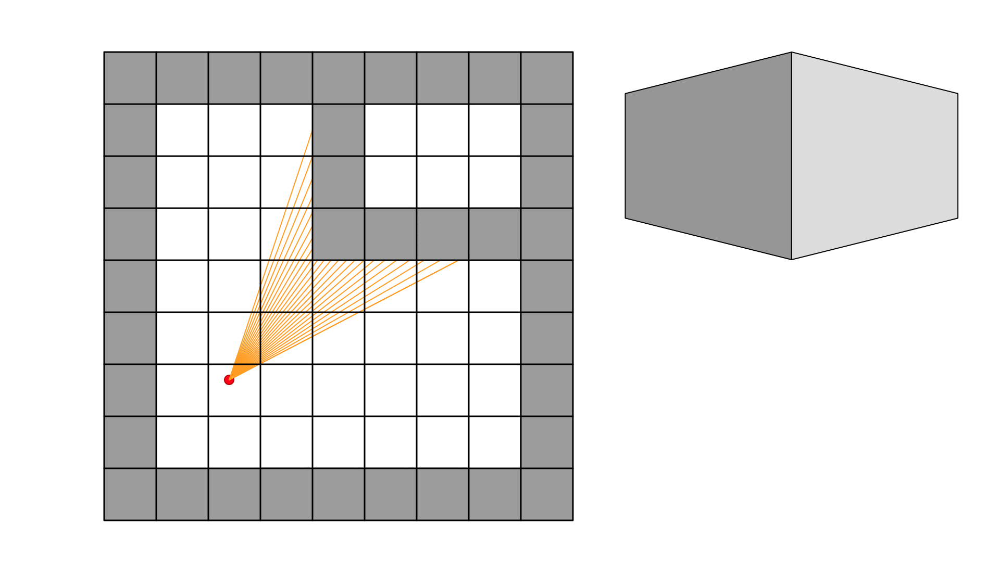
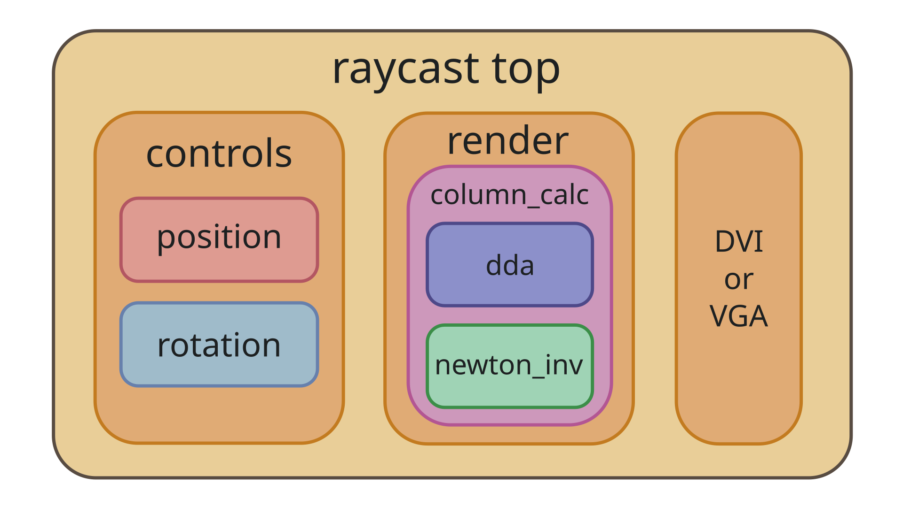
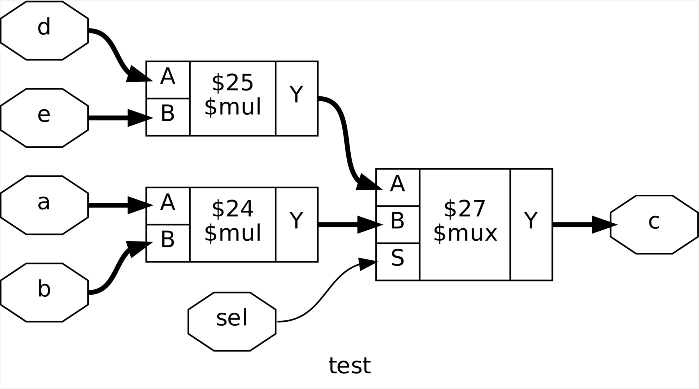
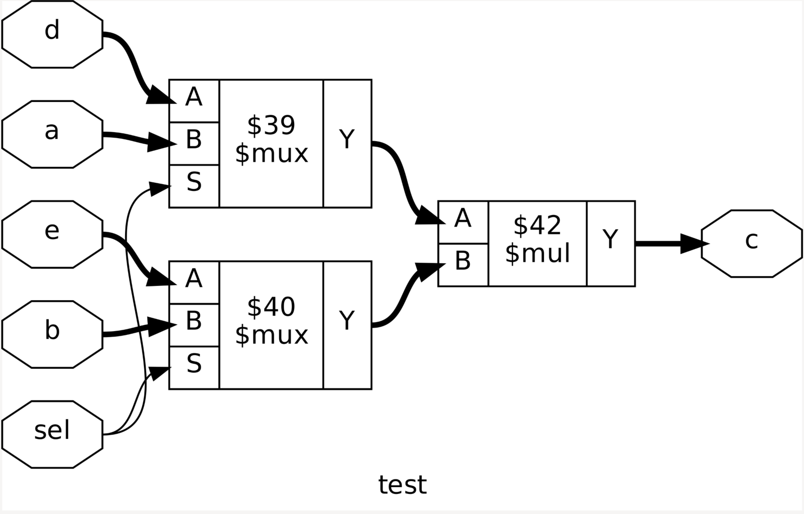
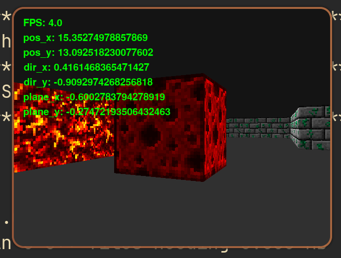

> **Автор**: mkudinov

# Псевдо-3D на FPGA в стиле Wolfenstein 3D


Какое-то время назад в одном чате увидел
[проект](https://github.com/dylan-dang/verilog-raycaster) студента, который на
SystemVerilog реализовал алгоритм рендеринга как в [Wolfenstein
3D](https://en.wikipedia.org/wiki/Wolfenstein_3D). Однако он показал только
демо для Verilator, где графика выводится в окне через SDL2. Работает ли это в
железе - я так и не понял.

Но идея показалась мне очень интересной, поэтому я решил написать свой
вариант. Приключение на 20 минут в итоге заняло у меня 5 месяцев не самой
спешной разработки, в процессе которой немного доработал используемые тулы.

Как всегда, буду использовать опенсорсный тулчейн, а именно
[Yosys](https://yosyshq.net/yosys/) +
[yosys-slang](https://github.com/povik/yosys-slang) +
[nextpnr](https://github.com/YosysHQ/nextpnr) +
[Apicula](https://github.com/YosysHQ/apicula) для синтеза под плату Tang Primer
20K, а для симуляции - связку из
[Verilator](https://github.com/verilator/verilator) и
[Cocotb](https://www.cocotb.org/).

## В чем идея

Основная мысль довольно простая: из определенной точки пускаются лучи, которые
идут по карте до тех пор, пока не попадут на стену. Чем больше длина луча, тем
дальше стена находится от нашей точки, тем меньше эту стену нужно нарисовать на
экране.



Этот алгоритм хорошо подходил для слабых компьютеров во время первых 3D игр,
потому что нужно посчитать только одно значение (высоту стены) для всего
столбца пикселей на экране. То есть для разрешения 640x480 нужно посчитать
только 640 значений высоты.

Я не буду здесь описывать все детали алгоритма и его реализации в железе,
потому что он довольно объемный, так что если хотите узнать чуть больше, то я
написал довольно подробный
[readme](https://github.com/max-kudinov/hardware_raycast/blob/master/docs/algorithm.md),
а также советую заглянуть в [статью](https://lodev.org/cgtutor/raycasting.html)
от Lode Vandevenne, где описан алгоритм на C++, который я взял за основу своего
дизайна.

## Реализация

Расскажу пару фишек из реализации.

### Архитектура



Дизайн должен реагировать на кнопки управления, за это отвечает блок `controls`,
который включает в себя `position` для перемещения по карте и `rotation` для
поворота камеры.

За отрисовку графики отвечает `render`, который включает в себя конечный автомат
для вычисления высоты стены в конкретных колонках через лучи, а также выходной
конвейер для наложения текстур поверх стен. Для вычисления длины луча
используется алгоритм [Digital Differential
Analyzer](https://en.wikipedia.org/wiki/Digital_differential_analyzer_(graphics_algorithm)),
а также вспомогательный модуль для реализации деления через ньютоновские
итерации.

Далее для вывода картинки используется DVI или VGA.

### Resource sharing

Поскольку за 1 кадр нужно посчитать только одно значение для каждой колонки на
экране, то делать конвейер для вычисления лучей смысла нет, достаточно
конечного автомата. Чтобы задача была немного интереснее, я решил попробовать
сделать реализацию минимальной по утилизации ресурсов FPGA.

Добиться такого можно с помощью переиспользования одной и той же логики в разных
состояниях конечного автомата. Рассмотрим, как это происходит в Yosys на примере
простого умножения.

```SystemVerilog
always_comb
    if (sel)
        c = a * b;
    else
        c = d * e;
```

После чтения исходников фронтендом и команд `proc; clean`, чтобы раскрыть always
процесс и убрать все лишнее, получаем следующий нетлист:



Как можно увидеть, на данном этапе нетлист выглядит ровно так, как написано на
SystemVerilog: 2 умножителя и мультиплексор. Но синтезатор достаточно умный,
чтобы заметить, что сигнал `sel` выбирает один из двух умножителей, иными
словами, 2 умножителя никогда не будут использоваться одновременно. А это
значит, что их можно объединить в 1.

Для этого пишем команду `share` и немного упрощаем логику через `opt`:



Теперь в нетлисте 2 мультиплексора и 1 умножитель, что существенно дешевле по
используемым ресурсам. Если в роли `sel` использовать состояние конечного
автомата, то таким образом можно экономить логику.

### Fixed point

Изначальный алгоритм на C++ использует floating point. Поскольку моей задачей
является экономия ресурсов, то вся дробная арифметика написана на fixed point.
Причем, зная ограничения диапазона значений разных сигналов, можно оптимально
подобрать ширины, дополнительно сэкономив логику.

Для описания fixed point чисел в SV я использую следующую запись:
`[INT-1:-FRAC]`. Таким образом, биты с 0 до `INT-1` представляют целую часть
числа, а с -1 до `-FRAC` - дробную (да, индексы могут быть отрицательными).
Например, `logic [7:-10] num` имеет 8 бит целой части (с 0 до 7) и 10 бит
дробной части (c -1 до -10).

Плюс такой записи состоит в том, что данные о целочисленной и дробной ширине
хранятся в самом типе данных. Получить целочисленную ширину можно через функцию
`$left(num) + 1`, а дробную через `-$right(num)`. Это удобно, поскольку эта
информация нужна для некоторых fixed point операций, например, умножения.

Через fixed point модель на Python я подобрал минимальные ширины, с которыми
картинка выглядит нормально. В SV созданы параметры и типы данных для каждой
группы fixed point значений. Вот пример некоторых типов:

```SystemVerilog
localparam int unsigned RAY_W_INT      = 2;
localparam int unsigned RAY_W_FRAC     = 10;

localparam int unsigned POS_W_INT      = 5;
localparam int unsigned POS_W_FRAC     = 8;

localparam int unsigned SIDE_W_INT     = 1;
localparam int unsigned SIDE_W_FRAC    = 8;

localparam int unsigned EXT_POS_W_INT  = 8;
localparam int unsigned EXT_POS_W_FRAC = 8;

typedef logic signed [RAY_W_INT-1:-signed'(RAY_W_FRAC)]         ray_fixp_t;
typedef logic        [POS_W_INT-1:-signed'(POS_W_FRAC)]         pos_fixp_t;
typedef logic        [SIDE_W_INT-1:-signed'(SIDE_W_FRAC)]       side_fixp_t;
typedef logic        [EXT_POS_W_INT-1:-signed'(EXT_POS_W_FRAC)] ext_pos_fixp_t;
```

Для базовых операций с fixed point типами я написал ряд макросов. Изначально
планировалось использовать параметризуемые функции, но они пока не полностью
поддерживаются в FOSS тулах.

Приведу пример умножения с округлением. Макрос предполагает, что два аргумента
имеют один тип данных. Как многие знают, результат умножения имеет ширину в 2
раза больше, чем входные аргументы, и сохранять это расширение я не хочу,
рассчитывая, что переполнения из исходного типа не произойдет. Поэтому
результат надо правильно обрезать. Если с целочисленными значениями все
понятно (достаточно обрезать старшие биты), то с fixed point все немного хитрее:
в 2 раза расширилась целочисленная часть и дробная часть. Поэтому из результата
нужно "забрать" середину: обрезать старшие биты целочисленной части и младшие
биты дробной части.

Именно это и делает следующий макрос:

```SystemVerilog
`define FIXP_MULT(a, b)              \
    type(a)'(                        \
        (2 * $size(a))'(             \
            ((a * b) +               \
            (1 << (-$right(a) - 1))) \
            >> -$right(a)            \
        )                            \
    )
```

Сначала надо закастить умножение в ширину `2 * $size(a)`, потому что иначе,
исходя из контекста выражения в SV, мы получим только младшую часть
результата умножения. Затем добавляется 1 в дробной части для правильного
округления.

Следующим шагом нужно обрезать лишнее до нужной ширины:

1. Сдвигаем биты вправо на количество дробных бит, чтобы убрать удвоение
   дробной части после умножения.
2. Кастим результат в изначальный тип, чтобы отбросить лишние старшие биты
   после удвоения целочисленной части.

Поскольку макросу могут передаваться разные типы, конкретный тип аргумента
находится через оператор `type()`, после чего происходит каст выражения в этот
тип.

### Деление

С точки зрения различных оптимизаций алгоритм на C++ уже написан очень хорошо:
тригонометрия и квадратные корни были упрощены; из того, что плохо реализуется
в железе, осталось только деление.

Для некоторых мест это не критично, деление можно выполнить в elaboration time
над параметрами. Но все же осталась пара мест, где деление пришлось реализовать
в железе.

Все эти места находятся в состояниях конечного автомата, с большим запасом по
задержке, так что деление тоже реализовано итеративно внутри FSM. Я использую
[Newton-Raphson
method](https://en.wikipedia.org/wiki/Division_algorithm#Newton%E2%80%93Raphson_division).

Основная идея в том, что `a/b` можно заменить на `a * 1/b`. Далее `1/b`
находится итеративно по
[формуле](https://en.wikipedia.org/wiki/Newton%27s_method#Multiplicative_inverses_of_numbers_and_power_series).
Таким образом, деление заменяется на итеративное умножение и вычитание.

Немного подробнее про реализацию тоже можно почитать в
[readme](https://github.com/max-kudinov/hardware_raycast/blob/master/docs/rtl.md).

## Как это все верифицировать?

Для написания тестбенчей я обычно использую cocotb, и этот проект не стал
исключением. Особенным плюсом для рендеринга было то, что я хотел сделать
не только сравнение выхода дизайна с референсной моделью, но еще и отрисовку
графики в окне симуляции, с управлением движением через клавиатуру.

Для этого прекрасно подходит [pygame](https://www.pygame.org/), который в
cocotb подключается за пару строчек.

А вот что не было прекрасным, так это написание fixed point референсной модели.
Библиотеки либо реализуют арифметику на самом Python, и получается очень
медленно, либо используют под капотом C, что быстрее, но при этом автоматически
расширяют результат при каждой операции. Я использовал библиотеку
[fpbinary](https://fpbinary.readthedocs.io/en/latest/intro.html), в результате
мне приходилось кастить каждый результат обратно в нужную ширину, что, конечно
же, плохо сказалось на производительности. Ну и в целом управлять fixed point
выражениями было крайне неудобно. В будущем fixed point модели я буду пробовать
писать иначе, вероятно, через DPI.

Но в итоге получаем довольно симпатичное окно с основными метриками. Тест можно
запустить в разных режимах, от floating point без проверки дизайна до сравнения
каждого пикселя на выходе конвейера. Соответственно, скорость будет разная, от
10-15 FPS до одного кадра в минуту.



Если интересно узнать чуть больше про тестовое окружение, то опять же, у этого
есть своя
[страница](https://github.com/max-kudinov/hardware_raycast/blob/master/docs/sim.md)
в репозитории.

## Ну а что там с Yosys?

Как я писал выше про resource sharing, моей основной идеей в RTL для оптимизации
было объединение разной логики (в частности, умножителей). Но на практике
при синтезе под Gowin я получил весьма неожиданный результат.

За пример возьмем все тот же код:

```SystemVerilog
always_comb
    if (sel)
        c = a * b;
    else
        c = d * e;
```

Используем команду/скрипт `synth_gowin` и при ширине всех сигналов в 16 бит
получаем следующее:

```Text
 2314 cells
    1   GND
   65   IBUF
  157   LUT1
  206   LUT2
  193   LUT3
  802   LUT4
  550   MUX2_LUT5
  219   MUX2_LUT6
   81   MUX2_LUT7
   23   MUX2_LUT8
   16   OBUF
    1   VCC
   32 submodules
   32   ALU
```

Я ожидал увидеть инференс DSP умножителя, причем одного, а получил 2300 ячеек
логики для реализации умножения.

Но Yosys вставлять DSP точно умеет, в этом можно убедиться, запустив скрипт под
Lattice `synth_ecp5`:

```Text
 1 cells
 1   MULT18X18D
32 submodules
32   LUT4
```

Если открыть исходники скриптов синтеза, то все становится понятно: в
`synth_gowin` поддержка инференса DSP умножителей просто отсутствует, в то
время как в Lattice все уже
[есть](https://github.com/YosysHQ/yosys/blob/c96d7bc9984286b0532e09c5dc7dc877ac1e39df/techlibs/lattice/synth_lattice.cc#L431).
В Matrix чате проекта Apicula, который и занимается всем открытым тулчейном под
Gowin, главный мейнтейнер мне ответил, что в основном занимается
реверс-инжинирингом битстрима и PnR, так что со стороны синтеза в Yosys еще
много работы. После чего сказал, что если у меня получится добавить инференс
DSP, то было бы классно.

Ну, чтобы скопировать то, что уже готово в Lattice, много ума не нужно, поэтому
инференс DSP умножителей в Yosys я
[добавил](https://github.com/YosysHQ/yosys/pull/5670).

В чипах Gowin серий GW1N и GW2A есть 3 вида умножителей: `MULT9X9`, `MULT18X18`
и `MULT36X36`. Задача в том, чтобы подставить нужный примитив под каждый диапазон
ширин, то есть чтобы умножение 25x32 заняло 1 примитив `MULT36X36`, а не несколько
9x9 или 18x18.

Для этого создаем структуру с диапазоном ширин аргументов:

```C++
struct DSPRule {
    int a_maxwidth;
    int b_maxwidth;
    int a_minwidth;
    int b_minwidth;
    std::string prim;
};
```

После чего создаем вектор с примитивами и диапазоном ширин для инференса, от
большего к меньшему:

```C++
const std::vector<DSPRule> dsp_rules = {
    {36, 36, 22, 22, "$__MUL36X36"},
    {18, 18, 10, 4, "$__MUL18X18"},
    {18, 18, 4, 10, "$__MUL18X18"},
    {9, 9, 4, 4, "$__MUL9X9"},
};
```

После чтения исходного кода умножение `*` переводится в абстрактную ячейку
`$mul`. Так что первым этапом берем имя примитива с ширинами из вектора и
пробуем размапить абстрактный `$mul` на диапазон для конкретного примитива с
помощью команды `techmap`. Причем сначала идут наибольшие ширины, и только если
они не подходят, то спускаемся на более мелкие.

```C++
run(stringf("techmap -map +/mul2dsp.v -D DSP_A_MAXWIDTH=%d -D DSP_B_MAXWIDTH=%d -D DSP_A_MINWIDTH=%d -D DSP_B_MINWIDTH=%d -D DSP_NAME=%s",
    rule.a_maxwidth, rule.b_maxwidth, rule.a_minwidth, rule.b_minwidth, rule.prim));
run("chtype -set $mul t:$__soft_mul");
```

После каждого вызова techmap с файлом `mul2dsp.v`, если ширины умножения не
попали в нужный для примитива диапазон, то как fallback создается ячейка
`$__soft_mul`. Нам она не нужна, так что меняем ее обратно на `$mul` через
команду `chtype` для следующей итерации.

Теперь, когда мы раскидали абстрактное умножение по конкретным диапазонам с
нужными примитивами, время подставить те самые примитивы через второй вызов
`techmap`:

```C++
run("techmap -map +/gowin/dsp_map.v");
```

Файл `dsp_map.v` выглядит следующим образом: для каждого вендор примитива есть
обертка, содержащая параметры, которые будут переопределены вызовом `techmap`.

```SystemVerilog
module \$__MUL9X9 (input [8:0] A, input [8:0] B, output [17:0] Y);

    parameter A_WIDTH = 9;
    parameter B_WIDTH = 9;
    parameter Y_WIDTH = 18;
    parameter A_SIGNED = 0;
    parameter B_SIGNED = 0;

    MULT9X9 __TECHMAP_REPLACE__ (
        .CLK(1'b0),
        .CE(1'b0),
        .RESET(1'b0),
        .A(A),
        .SIA({A_WIDTH{1'b0}}),
        .ASEL(1'b0),
        .ASIGN(A_SIGNED ? 1'b1 : 1'b0),
        .B(B),
        .SIB({B_WIDTH{1'b0}}),
        .BSEL(1'b0),
        .BSIGN(B_SIGNED ? 1'b1 : 1'b0),
        .DOUT(Y)
    );

endmodule
```

Со стороны синтеза инференс DSP умножителей готов.

Но не обошлось без веселья: на этапе packing в nextpnr был баг, который ломал
логику на относительно больших дизайнах, с утилизацией нескольких DSP различной
ширины. Я долго не мог понять, в чем дело, ведь на минимально воспроизводимых
примерах на плате все работало. Я был уверен, что сделал где-то ошибку в
синтезе, и спустя неделю чтения нетлистов на 100 000 строк все же догадался
запустить симуляцию нетлиста. И в ней не было ошибок. После того, как я написал
об этом в тот же чат Matrix, в течение суток была найдена и
[исправлена](https://github.com/YosysHQ/nextpnr/pull/1633) проблема в PnR.

Теперь тот же самый пример с умножением выдавал ожидаемый результат:

```Text
115 cells
  1   GND
 65   IBUF
 32   LUT3
  1   MULT18X18
 16   OBUF
```

Как можно заметить из инстанса DSP ячейки выше, сейчас она используется
исключительно в асинхронном режиме. Если входы или выходы умножения - регистры,
то они будут отдельными триггерами, соединенными с умножителем через fabric,
хотя в теории могли бы быть частью самой DSP ячейки. Такой инференс возможен в
Yosys, но он сложнее, чем `techmap`, так что я оставил его на будущее. Вообще с
точки зрения инференса в Yosys есть множество еще нереализованных идей,
которыми можно заняться.

## yosys-slang

Я уже давно не использую дефолтный фронтенд для SV в силу его ограниченности и
появления плагина [yosys-slang](https://github.com/povik/yosys-slang).

Но для работы с FPGA мне не хватало последнего - поддержки функций
`$readmem[h/b]`. Через `$readmemh()` я инициализирую карту, а также текстуры и
LUT для декодирования значений пикселей текстур. Если открыть стандарт
IEEE-1800 2023, можно увидеть, что эти функции немного интереснее, чем может
показаться на первый взгляд. А именно:

* Аргументов может быть от 2 до 4, дополнительно можно указать начальный адрес
в памяти, с которого начнется инициализация, и конечный адрес соответственно.
* Начальный адрес может быть больше конечного, в таком случае память будет
инициализирована в обратном порядке.
* В файле все константы 4 state, то есть можно писать `X` и `Z`.
* Внутри файла можно ставить знак `@` с последующим шестнадцатеричным адресом
для перехода между адресами памяти во время инициализации.

Проект yosys-slang в первую очередь ориентирован на ASIC, так что нацеленная на
FPGA функция не спешила появляться, поэтому я решил с этим немного помочь и
[добавил](https://github.com/povik/yosys-slang/pull/298) поддержку.

Ревью моего PR пришлось ждать 2 месяца, но хороших вещей можно и подождать.

## Итоги


И вот, наконец, бэкенд и фронтенд Yosys работают, как мне нужно, и я получил
следующий результат по утилизации. Это репорт после packing в nextpnr, а не
список примитивов после синтеза в нетлисте, так что результат точно отображает
то, что будет использоваться при конфигурации в битстриме. Для простоты я убрал
из репорта все примитивы, которые не используются вовсе.

```Text
Info: Device utilisation:
Info:                    VCC:       1/      1   100%
Info:                    IOB:      16/    384     4%
Info:                   LUT4:    2294/  20736    11%
Info:              MUX2_LUT5:     257/  10368     2%
Info:              MUX2_LUT6:      44/   5184     0%
Info:              MUX2_LUT7:      10/   2592     0%
Info:                    ALU:     976/  15552     6%
Info:                    GND:       1/      1   100%
Info:                    DFF:     961/  15552     6%
Info:              RAM16SDP4:       1/    648     0%
Info:                  BSRAM:       7/     46    15%
Info:              MULT18X18:       8/     48    16%
Info:                MULT9X9:       8/     96     8%
Info:                    GSR:       1/      1   100%
Info:                   rPLL:       1/      4    25%
Info:                 CLKDIV:       1/      8    12%
Info:                CLKDIV2:       1/     16     6%
```

2294 LUT4 с 976 ALU, а также всего 16 умножителей считаю вполне себе хорошим
результатом. Версия с VGA занимает еще меньше места, потому что сам драйвер
проще:

```Text
Info: Device utilisation:
Info:                    VCC:       1/      1   100%
Info:                    IOB:      22/    384     5%
Info:                   LUT4:    1673/  20736     8%
Info:              MUX2_LUT5:     112/  10368     1%
Info:                    ALU:     832/  15552     5%
Info:                    GND:       1/      1   100%
Info:                    DFF:     856/  15552     5%
Info:              RAM16SDP4:       1/    648     0%
Info:                  BSRAM:       7/     46    15%
Info:              MULT18X18:       8/     48    16%
Info:                MULT9X9:       8/     96     8%
Info:                    GSR:       1/      1   100%
Info:                   rPLL:       1/      4    25%
```

Получаем 1673 LUT4 и 832 ALU. Однако VGA пока не добавлен в основную ветку,
потому что на последних версиях nextpnr у меня стали падать тайминги по холдам
и дизайн перестал адекватно работать именно с VGA. Проблема в неточных тайминг
моделях, в которых может быть ошибка по причине того, что данные были получены
путем реверс-инжиниринга. Все же не стоит забывать, что весь OSS тулчейн под
Gowin в настоящее время в статусе experimental.

Все исходники проекта можно найти в
[репозитории](https://github.com/max-kudinov/hardware_raycast).

Подводя итог проведенной работы, хотел бы ответить на вопрос: имеет ли смысл
реализовывать алгоритм рейкастинга на аппаратном уровне? Нет.
