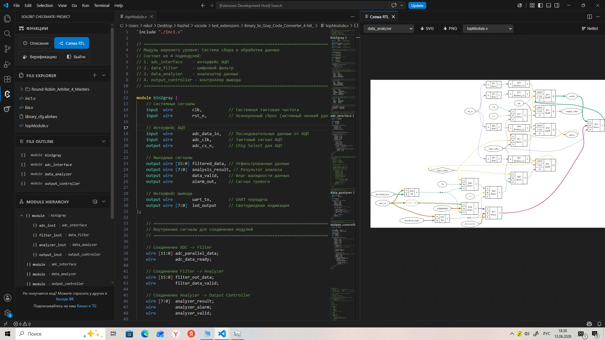
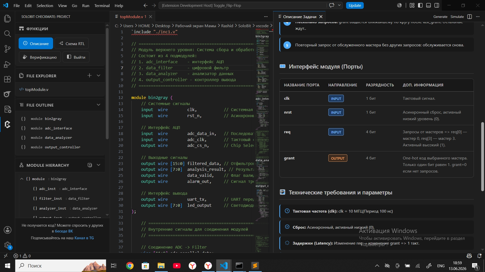
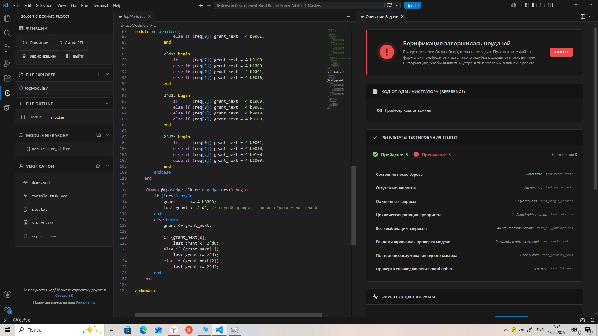
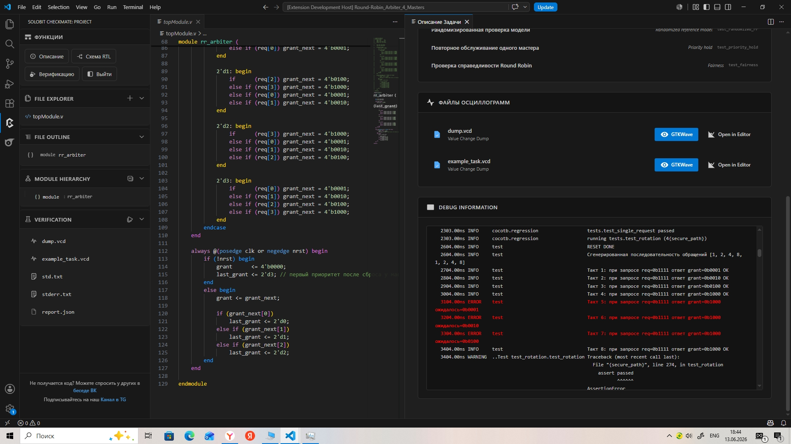

# Расширение Solobit CheckMate

> автор: *Бабаев Рашид, Senior Quantitative Software Engineer, в свободное время Admin ["DocsTech & Solobit"](https://t.me/docstech_offical)*

Расширение уже в маркетплейсе VSCode 16.06.2026, новости вы сможете отслеживать в группе ["DocsTech & Solobit"](https://t.me/docstech_offical). Сейчас на рынке есть либо "песочницы" типа HDLBits, где тесты и задачи примитивные про написании сложным задачи циклического сдвигового регистра. Мы предлагаем не просто задачи, а именно те, что попадутся вам на производстве! От последовательного сумматора -> Написание Интерфейса SPI -> Блок управления памятью (MMU) / TLB, Детектор и корректор ошибок, Схема восстановления тактовой частоты из данных (CDR). Не нужны Проприетарное ПО Vivado, которые требуют гигабайты памяти и тратить кучу времени на запуск только ради того, чтобы мигнуть светодиодом.

**SoloBit CheckMate** это не просто "еще один плагин для подсветки синтаксиса в VS Code". Это полноценная среда для прокачки ваших скиллов в дизайне: разрыву между Техническим Заданием, которое в реальности часто пишут на салфетке, и реальным синтезируемым кодом, который не развалится на этапе Place & Route. 

Мы создали среду, где путь от чтения ТЗ до анализа синтезированной RTL-схемы и дебага осциллограммы занимает секунды. Это адский буст для обучения и прототипирования. Если вы дизайнер, который хочет почувствовать легкость при написании кода и понимать ее результаты - ждите расширение в магазине VS Code. Скачивайте И дайте обратную связь, нам это очень важно.

## 1. Yosys RTC RTL: Ваша схема обновляется быстрее, чем вы сохраняете файл

Многие знают **Yosys**, но давайте признаем: помнить все команды и вспомогательные команды с их аргумента для синтеза или техпроцесса. Строить файл по 5 этапам оптимизации и техпроцесс убивает много времени, тем более на поиск ошибок. Прописывать `proc; opt; fsm; memory;`, постоянно перезапускать скрипты, чтобы посмотреть на схему или Netlist после изменения одной строчки кода и заново запускать - это боль.

Мы реализовали **Real-Time Compilation (RTC) RTL Viewer**. Это стримовая передача вашего кода прямо в ядро Yosys. Как это работает для вас:

*   Вы пишете код в редакторе. Не нажимаете ничего.
*   В соседней вкладке, которая открывается одним кликом из панели **Functions**, автоматически поднимается синтезированная схема.
*   Изменили атрибут или добавили FSM - **схема пересобралась за секунду**! Это буквально WYSIWYG для мира аппаратного дизайна. Вы видите, как изменение кода влияет на связность логических элементов до того, как запустите полную симуляцию.
*   **Иерархия:** Можно смотреть не только Top-Level Entity. Кликайте на подмодули - схема раскроет содержимое. Хотите понять, как выглядит ваш параметризированный round-robin арбитр на уровне ячеек? Пожалуйста.
*   **Экспорт:** Схему можно выгрузить в PNG или SVG для документации. Не нужно делать скриншоты и обрезать их, чтобы показать коллеге структуру конвейера.

*Рисунок 1. Схема экзепляра модуля data_analyzer*

Да, опытные гуру, я слышу ваш вопрос: "А где прописать кастомные команды Yosys?" Пока убрано для чистоты первого релиза. Я хотел, чтобы инструмент работал надежно и без лишних настроек. Но в следующем патче я обязательно введу функционал под кастомный скрпит yosys для донастройки маппинга, это уже в бэклоге.

## 2. RTL: 100+ Задач с Идеальным ТЗ

Давайте честно. В CheckMate я реализовал раздел с более чем 100+ (Verilog(средний) и SystemVerilog(легкий/средний)), которые покрывают весь спектр: от примитивного сдвигового регистра до сложных Ethernet-клиентов. Но фишка не в количестве. Фишка в том, как подана спецификация. Мы не просто даем вам текст "сделайте FIFO" или "нужен SPI-мастер" и всё - это не спецификация, это плевок в душу. Я решил: в SoloBit CheckMate каждая задача будет иметь спецификацию, которую не стыдно принести на design review с заказчиком.

*Рисунок 2. ТЗ средней задачи по SystemVerilog*

Вот структура, которую получает пользователь для каждой из 100+ задач:

### Раздел 1. Общая информация: контекст, а не абстракция

- **Название модуля/блока.** Не абстрактное "задача №42", а конкретное инженерное имя: `shift_reg_4bit`, `eth_dcp_client`, `axi4_stream_fifo_wrapper`. Вы с первого взгляда понимаете, с чем работаете.
- **Назначение.** Одно-два предложения, которые ставят модуль в реальный контекст. Например: "Модуль тактовой синхронизации для CDC-перехода между доменами 100 МГц и 50 МГц. Применяется в интерфейсах между Ethernet MAC и пользовательской логикой". Вы уже мысленно прикидываете архитектуру.

### Раздел 2. Функциональное описание: что на самом деле происходит внутри

- **Принцип работы.** Краткое, но ёмкое описание логики. Алгоритм, протокол, математическая модель. Для DSP-задач - формула. Для контроллеров - словесное описание FSM.
- **Основные функции.** Маркированный список ключевых фич модуля. Не "работает", а: "Поддержка полнодуплексной передачи", "Автоматическая вставка паузы в 12 тактов", "Детект ошибки протокола и сигнализация через `err_o`".
- **Функциональная схема (блок-диаграмма).** Только для сложных задач. Показывает, как модуль нарезан на Datapath и Control Unit, какие субблоки за что отвечают, как они связаны. Визуальная архитектура - это полдизайна.
- **Сценарии работы.** Не просто "модуль что-то делает", а потактовое описание:
  - *Инициализация:* "После снятия асинхронного сброса (активный низкий уровень) модуль переходит в IDLE. Все выходные регистры обнулены. `ready_o = 0`."
  - *Нормальный режим:* "При подаче `start_i = 1` автомат переходит в состояние FETCH. Выставляется `busy_o = 1`. Внешний мастер должен удерживать данные на шине `data_i` до получения `ack_o`."
  - *Обработка ошибок:* "При таймауте (счётчик внутренних тактов > `TIMEOUT_VAL`) модуль переходит в FAULT. `err_code_o = 0x2`. Выход из FAULT только по внешнему сбросу."
  - *Сброс:* "Асинхронный сброс имеет приоритет над любым внутренним состоянием. Выходные регистры сбрасываются немедленно без ожидания тактового фронта."

Вы читаете это и понимаете структуру будущего FSM.

### Раздел 3. Интерфейс модуля (Порты):

Каждый порт описан с дотошностью, за которую меня, возможно, ненавидят, но без которой невозможен синтезируемый дизайн:

- **Название порта:** строго по naming convention (`clk_i`, `rst_ni`, `data_valid_o`).
- **Направление:** Input / Output - жёстко.
- **Разрядность:** `[7:0]`, `[DATA_WIDTH-1:0]` - параметризованная или фиксированная.
- **Тип:** `wire` или `reg` (для Verilog-задач).
- **Активный уровень:** высокий/низкий. Особенно критично для сбросов и enable-сигналов.
- **Синхронность:** указание тактового домена (для однотактовых задач - `clk_i`, для CDC-задач - конкретный домен).

### Раздел 4. Технические требования и параметры: инженерный чек-лист

- **Тактовая частота:** Целевое значение. Не "сколько-то", а "100 МГц, период 10 нс". Сразу думаете о таймингах.
- **Сброс:** Тип (синхронный/асинхронный) и активный уровень. Это критично, потому что разные технологии любят разный сброс.
- **Задержки (Latency):** Вход -> Выход в тактах. Минимальная, максимальная. Для pipeline-дизайнов указывается latency по каждому пути.
- **Пропускная способность:** Для сложных блоков: бит/с, пакетов/с, тактов на слово.
- **Обработка ошибок:** Полный перечень нештатных ситуаций и требуемая реакция на каждую. Переполнение FIFO? Сигнал `overflow_o`, сброс указателя чтения. CRC mismatch? `err_crc_o`, пакет дропается, счётчик ошибок инкрементируется.

### Раздел 5. Внешние интерфейсы и протоколы (для сложных блоков)

Когда задача касается Ethernet, AXI, DCP или любого другого промышленного протокола:

- **Используемые протоколы:** Перечисление и версия (AXI4-Stream, Avalon-MM, MII/GMII, DCP). Сразу понятен класс задачи.
- **Соответствие стандартам:** Ссылка на спецификацию (IEEE 802.3, AMBA AXI Protocol Spec). Можно открыть и сверить тайминги.

### Раздел 6. Регистровая карта (Register Map)

Любая задача с управляющим или статусным интерфейсом получает полноценную таблицу регистров. Я использую формат, знакомый любому, кто открывал даташит на IP-ядро:

| Offset | Название | Доступ | Разрядность | Описание полей                       | Сброс |
| ------ | -------- | ------ | ----------- | ------------------------------------ | ----- |
| 0x00   | CTRL     | RW     | 32          | [0] ENABLE, [1] MODE, [31:2] RSVD    | 0x0   |
| 0x04   | STATUS   | RO     | 32          | [0] BUSY, [1] ERROR, [7:2] FSM_STATE | 0x0   |

Это приучает мыслить в терминах адресного пространства. Вы пишете RTL и сразу понимаете, как к нему будет обращаться софт.

### Раздел 7. Ограничения и рекомендации

Здесь собрал всё, о чём обычно забывают:

- **Стиль кодирования:** Требования к синтезируемости. Никаких `initial`, `fork/join` в синтезируемой части. Избегать inferred latches.
- **Целевая технология/ПЛИС:** Конкретный кристалл - значит, конкретные ограничения по ресурсам.
- **Потребление ресурсов (примерное):** ≤ 200 LUTs, ≤ 2 BRAM, 0 DSP. Это не догма, а ориентир. Если ваш дизайн раздулся до 1500 LUTs - вы явно что-то делаете не так.
- **Временные ограничения (Timing для сложных заданий):** в этом патче - справочно, в следующем будет полноценный анализ.

## 3. Верификация для взрослых: Cocotb, Verilator и расчлененный дамп

Ручной просмотр осциллограмм для дебага - это прошлый век. Верификационное окружение в CheckMate - это не просто кнопка "Check". Это мощная система на базе Cocotb + Verilator, которая эмулирует реальный стенд.

*   **Градация сложности тестов:**
    *   *Легкий уровень (Verilog):* Тесты проходят за 1-3 секунды. Простые constrained-random тесты без фанатизма.
    *   *Средний/Сложный (Verilog/SV):* Здесь включается динамическое построение тактовой сетки с элементами рандомизации. Это полноценные стресс-тесты (**более 1000 различных проверок внутри запуска**). Верификатор генерирует сложные временные диаграммы: паузы между valid/ready появляются в случайные моменты, нагружая логику предсказания переходов и буферизацию. Динамическое построение тактов. Один файл тестов - 8-20 отдельных тестов, от 1000 до 2000 строк чистого Cocotb.
*   **Тестбенчи:** Один файл с тестами расписан на 1000-2000 строк чистого Cocotb. Это не "подали 1 - получили 0". Там есть **рандомизация с ограничениями (constrained-random)**, покрывающая угловые случаи, о которых вы даже не задумались, когда писали блок.
*   **Результаты верификации - это не черный ящик:**
    *   `dump.vcd` - ваш дамп, то, как отработал ваш код.
    *   `example_task.vcd` - эталонный дамп, как должен выглядеть идеальный дизайн.
    *   `code_admin.txt` - референсный дизайн. Это не шпаргалка для списывания! Вы открываете этот файл и смотрите, как решил задачу я.
    *   `report.json` - машинно-читаемый отчет о падениях.
    *   `std.txt` - ПОЛНЫЙ лог действий на русском языке с временными метками. Каждая проверка расписана: "На такте 107 ожидалось значение 0xA5 на шине data_o, получено 0x05". Ошибки подсвечены красным.
*   **Интеграция GTKWave:** Вы просто кликаете на `dump.vcd` или `example_task.vcd` в панели **Verification**, и GTKWave открывается прямо в отдельном окне. Никаких внешних путей, никакой настройки `--dump`. Это как встроенный осциллограф в среду разработки.

*Рисунок 3 и 4. Верификация по SystemVerilog*

В этом релизе мы проверяем функциональность, снимаем STA (Static Timing Analysis) и используемые ресурсы. CDC (Clock Domain Crossing) и RDC (Reset Domain Crossing) в этом билде мы еще не анализируем - это требует колоссального объема эталонных моделей для каждого таска, но это будет в следующем мажорном обновлении.

## 4. Удобная Навигация

Левая боковая панель спроектирована так, чтобы минимизировать движения мышью. Никаких переходов в десять меню.
*   **Functions:** Четыре кнопки: "Описание" (открывает ТЗ), "Схема RTL" (Yosys), "Верификация" (старт и отчет) и "Выйти" (выбор другого задания).
*   **File Explorer:** Прямой доступ к исходникам задания.
*   **File Outline:** Ссылки на все объявления интерфейсов, пакетов, модулей, классов и программ. Кликнул - перешел к объявлению. Никакого серфинга по простыням SystemVerilog и Verilog кода с наследованием.
*   **Module Hierarchy:** Иерархия инстансов. Для больших SoC-подобных дизайнов (пусть даже учебных) это критично видеть дерево модулей для понимания иерархии.

## Что дальше

В следующем патче я добавлю:

- К сожалению, в данный момент не возможно применить функции вне проекта заданий, но мы скоро это исправим. (PS: лайфхак откопируйте папки с точечной нотацией в директорию в вашего проекта и все функции будут работать, кроме верификации)
- Функциональная, низкоуровневая и простая визуализация Конечных Автоматов 
- Файл команд для Yosys RTC RTL для режима эксперта.
- CDC-анализ (Clock Domain Crossing) & RDC-анализ (Reset Domain Crossing)
- Модели для автоматического + GUI создания Формальной Верификации
- Модели для автоматического + GUI написания кода верификации по методологии UVM на SV и Cocotb  

Но и сейчас, в первом релизе, HDL Forge умеет больше, чем многие внутренние тулчейны средних дизайн-центров. Я вылизывал это расширение, чтобы моя работа и работа тысяч других FPGA-инженеров перестала быть борьбой с инструментами и стала чистой инженерией.

