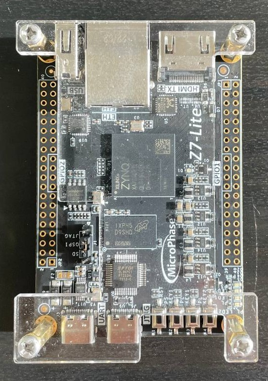

# Отладочная плата RFSoC ZU27DR Wishcolor 

## О плате

- Ресурсы производителя: [Ref manual](https://fpga-docs.microphase.cn/en/latest/DEV_BOARD/Z7-LITE/Z7-Lite_Reference_Manual.html)
- Мои потуги: [Github](https://github.com/smirnovich/microphase-z7)

На плате установлен чип xc7z020-1clg400c (PS+PL), у многих продавцов доступна версия с xc7z010-1clg400c. На плате стоит программатор с type-C разъемом. Джампером доступно управление последовательностью загрузки на три опции:

- JTAG
- QSPI
- SD

### PS периферия

- USB type-C UART
- microSD card slot
- 4Gbit DDR3 MT41J256M16 RE-125
- USB Host 3320C-EZK
- Winbond 16MB QSPI Flash W25Q128JVSIQ

### PL периферия

- HDMI Output (PL)
- Ethernet RTL8201F (PL)
- Leds and Buttons
- GPIO 2x20
