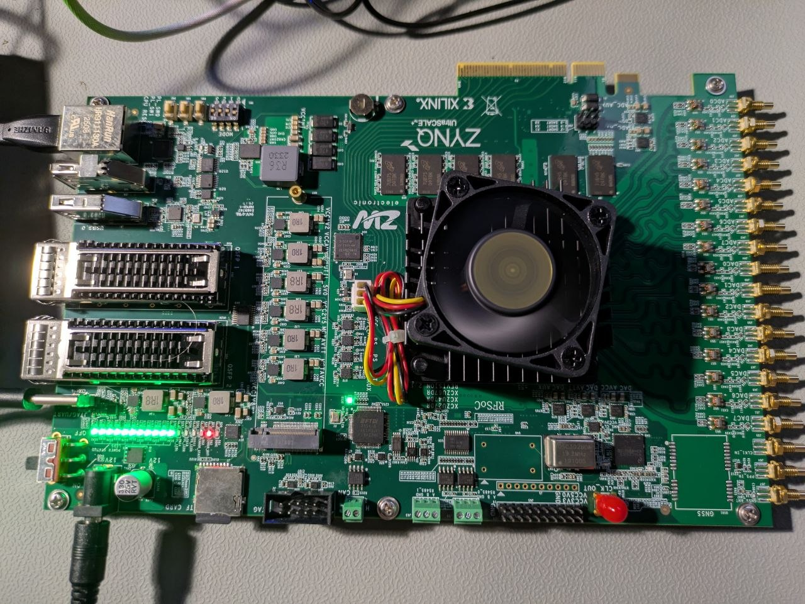

# Отладочная плата RFSoC ZU27DR Wishcolor 

## О плате

- Исходники от продавца: [GitVerse](https://gitverse.ru/fpga-systems/wishcolor-rfsoc)
- Ссылка на лот: [AliExpres](https://aliexpress.ru/item/1005012007913166.html)

FPGA на плате - `xczu27dr-fsve1156-2-i` - это RFSoC, у которого есть масса ресурсов, в частности PS и PL.

### PL

- DDR4 (MT40A1G16KD x2)
- QSFP interface
- UART

### PS
  - DDR4 (MT40A1G16KD-062E:E x4)
  - EEPROM
  - PCIe
  - USB 3.0
  - DP
  - Ethernet
  - QSPI Flash
  - eMMC (MTFC32GAPALBH)
  - SD-card slot
  - SI5341B
  - LMK04828BISQ
  - GNSS (NEO-M8N)
  - CAN
  - RS485 x2

### Ресурсы тактирования на плате

В примерах к плате идет сразу и код для инициализации источников тактирования, ниже схема тактирования с рекомендуемыми частотами

