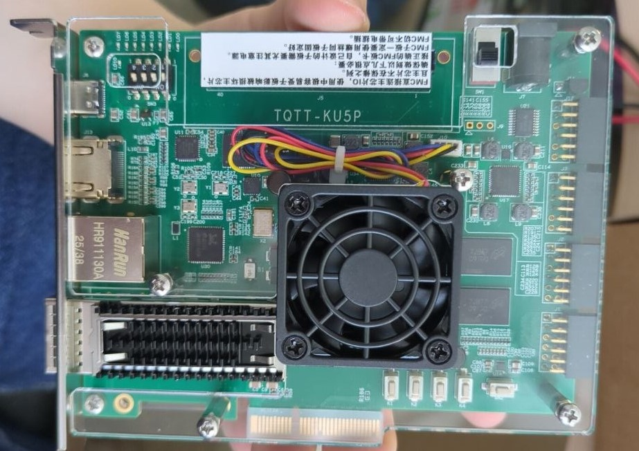

# Отладочная плата TQTT KU5P

## О плате

Сразу из отзывов в чате:

- rtl8211 ноги mdio и mdc ни куда не разведены, да и подключен он к 86 банку - который hd (high density) без iodelay
- Ущербность еще та. Памяти тока гиг, спи флеш на 16мб
- Лучше добавить 3тр и взять rk-xcku5p
- фиговая плата, там даже из QSFP шину I2C не вытянули, как читать DOM/DDMI не понятно 🤔, PMOD разведены как попало - могли бы сделать диф. пары как на Arty-A7, тогда можно было бы подключить PMOD-HDMI

А теперь о плате:

- чип FPGA:
