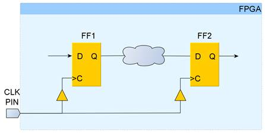
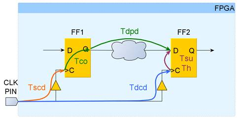

# Основы статического временного анализа. Часть 1: Period Constraint.

*О найденных опечатках и замечаниях просим сообщить в чате сообщества

 

## Введение
Данная статья является первой из планируемой серии статей по временным ограничениям в FPGA. Основная цель – познакомить начинающих разработчиков с основами статического временного анализа. В этой статье будет рассмотрен анализ самого простого случая – передача данных между двумя последовательными элементами внутри FPGA с общим тактовым сигналом. Показан вывод уравнений временного анализа и продемонстрировано их применение анализатором Vivado.

## 1. Цель статического временного анализа
Все производители FPGA в рекомендациях по разработке указывают на необходимость избегать наличия защелок (latch), поэтому грамотно сделанный проект представляет из себя синхронное последовательное цифровое устройство. Большая часть схемы любого синхронного устройства состоит из набора регистров, изменяющих свое состояние по фронту или спаду тактового сигнала, которые отделены друг от друга комбинационной логикой. Для определенности в дальнейшем будем считать, что данные передаются между регистрами по фронту тактового сигнала. Таким образом, типичный путь, который проходят данные внутри FPGA, имеет вид, представленный на рисунке 1.

_Рисунок 1. Типичный путь данных внутри FPGA._

При поступлении фронта данные с D входа триггера FF1 переходят на выход Q, распространяются через комбинационную логику и попадают на D вход триггера FF2. Данный фронт будем называть запускающий (source edge или launch edge). Спустя один период тактового сигнала появляется следующий фронт, по которому триггер FF2 защелкивает данные от FF1 на своем D входе и передает далее на свой выход. Одновременно с этим от FF1 начинают распространяться следующие данные. Такой фронт будем называть защелкивающий (destination edge или latch edge). Также будем называть FF1 запускающим триггером, а FF2 – защелкивающим.

Чтобы данные корректно распространялись от триггера к триггеру описанным выше образом, должны быть выполнены два ограничения:

- данные от FF1 должны распространяться достаточно быстро, чтобы успеть дойти до триггера FF2 раньше защелкивающего фронта (максимальное время распространения);
- следующие данные от FF1 должны распространяться достаточно медленно, чтобы защелкивающий фронт успел дойти до FF2 и захватить предыдущие данные от FF1 (минимальное время распространения).
Цель статического временного анализа заключается в том, чтобы для каждого пути (path) между двумя последовательными элементами рассчитать задержки распространения сигналов и установить, выполняются ли два приведенных выше ограничения. Считается, что путь данных начинается на тактовом входе запускающего элемента (триггер FF1) и заканчивается на информационном входе защелкивающего элемента (триггер FF2).

Рассмотрим, каким образом временной анализатор решает эту задачу. На рисунке 2 представлен путь, на который нанесены задержки для данных и тактового сигнала.

_Рисунок 2. Путь с задержками для данных и тактового сигнала._

Ниже даны определения задержек, представленных на рисунке 2.

- \(T_{CSD}\) (**S**ource **C**lock **D**elay) – задержка тактового сигнала от источника, в нашем примере ножка FPGA clk_pin, до тактового входа триггера `FF1`;
- \(T_{TSD}\) $T_{tsd}$ (**D**estination **C**lock **D**elay) – задержка тактового сигнала от источника до тактового входа триггера `FF2`;
- \(T_{CO}\)  (**C**lock to **O**utput) – интервал времени между приходом фронта на тактовый вход триггера и появлением данных на выходе `Q`;
- \(T_{DPD}\)  (**D**ata **P**ropagation **D**elay) – задержка распространения данных по соединениям (nets) и через комбинационную логику;
- \(T_{SU}\) (**S**et**U**p time) – время установки. До прихода защелкивающего фронта данные на D входе триггера уже должны быть стабильны в течении времени \(T_{SU}\).
- \(T_{H}\) (**H**old time) – время удержания. После прихода защелкивающего фронта данные на D входе триггера не должны изменяться в течении времени \(T_{H}\).

Будем обозначать период тактового сигнала как Tclk. При проведении временного анализа все события отсчитываются от некоторого нулевого момента времени, в качестве которого обычно рассматривается появление запускающего фронта на ножке FPGA.

## 2. Максимальное время распространения
Для начала рассмотрим, каким образом выполняется анализ для проверки ограничения на максимальное время распространения. Данный анализ также называют анализ по Setup.

Временной анализ по Setup всегда проводится для самого пессимистичного случая, которому соответствует максимально задержанный запускающий фронт, максимально медленное распространение данных и максимально быстро распространяющийся защелкивающий фронт.

На первом этапе рассчитывается время распространения данных до защёлкивающего триггера, считая, что запускающий фронт появляется на ножке FPGA в нулевой момент времени. Уравнения для расчета представлены ниже (см. рисунок 2):

- Время прибытия фронта к запускающему триггеру (**S**ource **С**lock **A**rrival time):
$T_{SCA\_MAX} = T_{SCD\_MAX}$ (1)
- Задержка распространения данных (**D**ata **D**elay):
$T_{dd\_max} = T_{CO\_max} + T_{dpd\_max}$ (2)