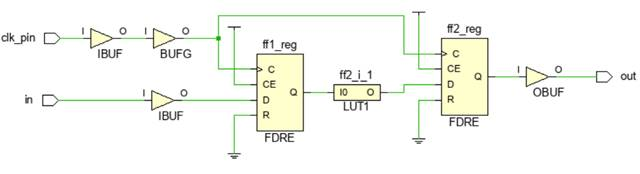
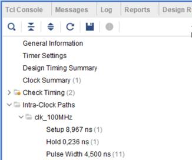
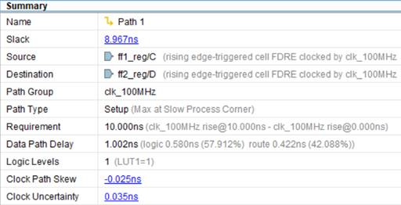
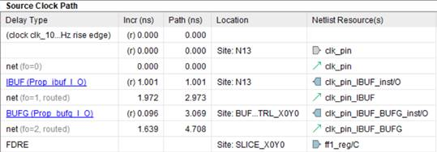
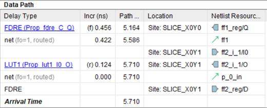
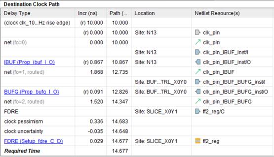

# Основы статического временного анализа. Часть 1: Period Constraint.

*О найденных опечатках и замечаниях просим сообщить в чате сообщества

 

## Введение
Данная статья является первой из планируемой серии статей по временным ограничениям в FPGA. Основная цель – познакомить начинающих разработчиков с основами статического временного анализа. В этой статье будет рассмотрен анализ самого простого случая – передача данных между двумя последовательными элементами внутри FPGA с общим тактовым сигналом. Показан вывод уравнений временного анализа и продемонстрировано их применение анализатором Vivado.

## 1. Цель статического временного анализа
Все производители FPGA в рекомендациях по разработке указывают на необходимость избегать наличия защелок (latch), поэтому грамотно сделанный проект представляет из себя синхронное последовательное цифровое устройство. Большая часть схемы любого синхронного устройства состоит из набора регистров, изменяющих свое состояние по фронту или спаду тактового сигнала, которые отделены друг от друга комбинационной логикой. Для определенности в дальнейшем будем считать, что данные передаются между регистрами по фронту тактового сигнала. Таким образом, типичный путь, который проходят данные внутри FPGA, имеет вид, представленный на рисунке 1.


_Рисунок 1. Типичный путь данных внутри FPGA._

При поступлении фронта данные с D входа триггера FF1 переходят на выход Q, распространяются через комбинационную логику и попадают на D вход триггера FF2. Данный фронт будем называть запускающий (source edge или launch edge). Спустя один период тактового сигнала появляется следующий фронт, по которому триггер FF2 защелкивает данные от FF1 на своем D входе и передает далее на свой выход. Одновременно с этим от FF1 начинают распространяться следующие данные. Такой фронт будем называть защелкивающий (destination edge или latch edge). Также будем называть FF1 запускающим триггером, а FF2 – защелкивающим.

Чтобы данные корректно распространялись от триггера к триггеру описанным выше образом, должны быть выполнены два ограничения:

- данные от FF1 должны распространяться достаточно быстро, чтобы успеть дойти до триггера FF2 раньше защелкивающего фронта (максимальное время распространения);
- следующие данные от FF1 должны распространяться достаточно медленно, чтобы защелкивающий фронт успел дойти до FF2 и захватить предыдущие данные от FF1 (минимальное время распространения).
Цель статического временного анализа заключается в том, чтобы для каждого пути (path) между двумя последовательными элементами рассчитать задержки распространения сигналов и установить, выполняются ли два приведенных выше ограничения. Считается, что путь данных начинается на тактовом входе запускающего элемента (триггер FF1) и заканчивается на информационном входе защелкивающего элемента (триггер FF2).

Рассмотрим, каким образом временной анализатор решает эту задачу. На рисунке 2 представлен путь, на который нанесены задержки для данных и тактового сигнала.


_Рисунок 2. Путь с задержками для данных и тактового сигнала._

Ниже даны определения задержек, представленных на рисунке 2.

- \(T_{CSD}\) (**S**ource **C**lock **D**elay) – задержка тактового сигнала от источника, в нашем примере ножка FPGA clk_pin, до тактового входа триггера `FF1`;
- \(T_{TSD}\) $T_{tsd}$ (**D**estination **C**lock **D**elay) – задержка тактового сигнала от источника до тактового входа триггера `FF2`;
- \(T_{CO}\)  (**C**lock to **O**utput) – интервал времени между приходом фронта на тактовый вход триггера и появлением данных на выходе `Q`;
- \(T_{DPD}\)  (**D**ata **P**ropagation **D**elay) – задержка распространения данных по соединениям (nets) и через комбинационную логику;
- \(T_{SU}\) (**S**et**U**p time) – время установки. До прихода защелкивающего фронта данные на D входе триггера уже должны быть стабильны в течении времени \(T_{SU}\).
- \(T_{H}\) (**H**old time) – время удержания. После прихода защелкивающего фронта данные на D входе триггера не должны изменяться в течении времени \(T_{H}\).

Будем обозначать период тактового сигнала как Tclk. При проведении временного анализа все события отсчитываются от некоторого нулевого момента времени, в качестве которого обычно рассматривается появление запускающего фронта на ножке FPGA.

## 2. Максимальное время распространения
Для начала рассмотрим, каким образом выполняется анализ для проверки ограничения на максимальное время распространения. Данный анализ также называют анализ по Setup.

Временной анализ по Setup всегда проводится для самого пессимистичного случая, которому соответствует максимально задержанный запускающий фронт, максимально медленное распространение данных и максимально быстро распространяющийся защелкивающий фронт.

На первом этапе рассчитывается время распространения данных до защёлкивающего триггера, считая, что запускающий фронт появляется на ножке FPGA в нулевой момент времени. Уравнения для расчета представлены ниже (см. рисунок 2):

- Время прибытия фронта к запускающему триггеру (**S**ource **С**lock **A**rrival time):

$T_{SCA\_MAX} = T_{SCD\_MAX}$ (1)
- Задержка распространения данных (**D**ata **D**elay):

$T_{dd\_max} = T_{CO\_max} + T_{dpd\_max}$ (2)
- Время прибытия данных на вход защелкивающего триггера (Data Arrival time):

$T_{da\_max} = T_{sca\_max} + T_{dd\_max}=T_{scd\_max}+T_{co\_max} + T_{dpd\_max}$ (3)

Далее вычисляется время прибытия защелкивающего фронта тактового сигнала и требуемое время прибытия данных. Защелкивающий фронт появляется через один такт после запускающего фронта, поэтому к задержке распространения добавлен один период тактового сигнала.
- Время прибытия фронта к защелкивающему триггеру (**D**estination **C**lock **A**rrival time):

$T_{dca\_min} = T_{dcd\_min} + T_{clk}$ (4)

- Требуемое время прибытия данных (**D**ata **R**equired time):

$T_{dr\_min} = T_{dca\_min} - T_{su} = + T_{dcd\_min} + T_{clk} - T_{su}$ (5)

В предыдущем уравнении учитывается, что данные должны прийти на время Tsu раньше защелкивающего фронта. Таким образом, чтобы выполнялось требование на максимальное время распространения (Setup), данные должны дойти до конца пути не позднее времени Tdr.

Результат работы статического анализатора представляется в виде запаса для задержки данных (_Slack_), который вычисляется по формуле:

$Slack = T_{dr\_min} - T_{da_max}$ (6)

Положительный Slack указывает на то, что данные доходят до места назначения раньше, чем это требуется. Отрицательное значение Slackозначает нарушение ограничения по Setup.

Используя ранее полученные уравнения, можно получить ряд выражений для расчета Slack

$Slack = T_{dca\_min} - T_{sca\_max} - T_{dd\_max} - T_{su}$

$Slack = T_{ck} + T_{dcd\_min} - T_{scd\_max} T_{co\_max} - T_{dpd\_max} - T_{su}$ (7)

Стоит заметить, что величина равная разности времени распространения тактового сигнал до запускающего и защелкивающего триггеров называется расфазировкой тактового сигнала (Clock Skew)

$T_{skew} = T_{dcd} - T_{scd}$ (8)

Можно увидеть, что положительное значение расфазировки при анализе по Setup увеличивает Slack.

## 3. Минимальное время распространения
Аналогичным образом рассмотрим, как выполняется анализ для проверки ограничения на минимальное время распространения. Данный анализ также называется анализом по Hold и проводится для самого пессимистичного случая, при котором запускающий фронт и данные распространяются наиболее быстро, а защелкивающий фронт – максимально медленно.

Глядя на рисунок 2, можно получить следующие уравнения:
- Время прибытия фронта к запускающему триггеру (Source Сlock Arrival time):

$T_{sca\_min}=T_{scd_min}$

- Задержка распространения данных (Data Delay):

$T_{dd\_min} = T_{co\_min} + T{dpd\_min}$

- Время прибытия данных на вход защелкивающего триггера (Data Arrival time):

$T_{da\_min} = T_{sca\_min} + T_{dd\_min}=T_{scd\_min} + T_{co\_min} + T_{dpd\_min}$

- Время прибытия фронта к защелкивающему триггеру (Destination Clock Arrival time):

$T_{dca\_max} = T_{dcd\_max}$

- Требуемое время прибытия данных (Data Required time):

$T_{dr\_max} = T_{dca\_max} + T_h = T_{dcd\_max} + T_h$

Защелкивающий фронт для предыдущих данных появляется в тот же момент времени, что и запускающий фронт для следующих данных, поэтому к задержке распространения Tdca период тактового сигнала не добавляется.

Слагаемое Th в уравнении для Tdr учитывает, что данные не должны изменяться в течении времени удержания после защелкивающего фронта. Формулируя по-другому – следующие данные должны прийти на время Th позже защелкивающего фронта для предыдущих данных.

Чтобы было удовлетворено ограничение по Hold, следующие данные должны попасть на D вход защелкивающего триггера не раньше времени Tdr.

При анализе по Hold выражение для вычисления Slack имеет вид:

$Slack = T_{da\_min} - T_{dr\_max}$ (10)

Если Slack положительный, то это значит, что следующие данные приходят позже, чем требуется. Отрицательное значение Slackуказывает на нарушение ограничения по Hold.

Используя полученные выше уравнения, выражение для Slack можно записать в виде:

$Slack = T_{sca\_min} + T_{dd\_min} - T_{dca\_max} - T_h$

$Slack = T_{scd\_min} + T_{co\_min} + T_{dpd\_min} - T_{dcd\_max} - T_h$ (11)

## 4. Временной анализ в Vivado
Рассмотрим каким образом Vivado выполняет временной анализ пути между двумя триггерами внутри FPGA.

При проведении синтеза создается схема проекта, состоящая из логических примитивов, поэтому для каждого пути известно через какие комбинационные элементы (LUT, MUX, CARRY CHAIN) он проходит. Типовые задержки для этих элементов приводятся в datasheet для конкретного кристалла. Например, для Artix 7 (DS181) [1] в таблице 27 указано время распространения через LUT (Tilo), а также время установки (Tas) и удержания (Tah) для триггеров. В таблицах 32 – 35 можно найти задержки при распространении сигнала через различные виды буферов.

После размещения и трассировки проекта появляется информация о задержках сигналов при распространении через nets(соединения) с учетом их длины. Таким образом, на этом этапе анализатору Vivado известны значения все переменных, которые входят в уравнения 7 и 11, кроме периода тактового сигнала Tclk, Тактовый сигнал поступает от внешнего генератора, частота которого для Vivado напрямую неизвестна.

Рассмотрим самый простой пример проекта, который состоит из двух триггеров между которыми расположен LUT, реализующий логическое отрицание. Схема проекта показана на рисунке 3. Описание на SystemVerilog представлено ниже:

```verilog
module top (
 input logic clk_pin,
 input logic in1,
 output logic out1
);
 logic ff1, ff2;

 always_ff @(posedge clk_pin)
 ff1 &lt;= in1;

 always_ff @(posedge clk_pin)
 ff2 &lt;= ~ff1;

 assign out1 = ff2;
endmodule
```


_Рисунок 3. Схема проекта._

Чтобы провести временной анализ и проверить проект на выполнение ограничений по Setup и Hold, в файле ограничений (xdc) требуется указать период тактового сигнала Tclk. Если считать, что значение Tclk равно 10 нс. (частота 100 МГц), то в xdc-файле необходимо записать следующую команду [2]:

`create_clock -period 10.000 -name clk_100MHz [get_ports clk_pin]`

Опция –period задает период в наносекундах. Конструкция `[get_ports clk_pin]` возвращает внешний порт проекта с именем `clk_pin`, указывая источник сигнала. С помощью опции –name можно задать имя тактового сигнала. Если этого не сделать имя тактового сигнала будет совпадать с именем порта.

Увидеть пути, для которых проведен временной анализ, можно, если после размещения и трассировки открыть отчет **Timing Summary** на вкладке **Intra-Clock Path / clk_100MHz**(рисунок 4).



_Рисунок 4. Разделы отчета Timing Summary._

## 5. Анализ ограничения по Setup
Открыв вкладку Setup раздела Intra-Clock Path и дважды нажав на одни из показанных путей, можно получить расширенный отчет Path Report. Данный отчет состоит из четырех разделов. Рассмотрим их по порядку.

Первый раздел представлен на рисунке 5. В данном разделе представлены общие сведения, такие как имя пути (Name), рассчитанный для данного пути Slack, имя и период тактового сигнала (PathGroup и Requirement). Началом пути является тактовый вход триггера FF1 (Source), а заканчивается путь на D входе триггера FF2 (Destination).

Также указывается задержка распространении данных (Data Path Delay), в наших обозначениях Tdd(уравнение 2), и количество уровней комбинационной логики. Для данного примера логика состоит из одного LUT, реализующего инвертор. Расфазировка тактового сигнала (Tskew из уравнения 8) в отчете обозначена как Clock Path Skew.

В конце раздела приводится значение неопределенности для тактового сигнала (_Clock Uncertainty_). Об этом параметре более подробно будет рассказано далее в статье в пункте 7.



_Рисунок 5. Общие сведения о пути._

В следующем разделе (рисунок 6) представлены задержки, оказывающие влияние на распространение запускающего фронта. В столбце Incr указаны значения отдельных задержек, а в столбце Path сумма текущей и всех предыдущих задержек. Можно увидеть, что запускающий фронт появляется в нулевой момент времени и распространяется через входной (IBUF) и тактовый (BUFG) буферы.

Общая задержка распространения запускающего фронта ($T_{sca}$ из уравнения (1)) составляет 4.708 нс. Символы (r) рядом со значениями задержек указывает, что анализируется фронт, а не спад тактового сигнала. 



_Рисунок 6. Задержка для запускающего фронта._

В разделе, представленном на рисунке 7, указаны задержки при распространении данных, которые состоят из задержки clock to output ($T_{co}$) для триггера FF1, задержки распространения через nets и LUT ($T_{ilo}$). Просуммировав значения в столбце Incr, получим 1.002 нс, что совпадает со значением Data Path Delay на рисунке 5.

Обратите внимание, что значения в столбце Path не начинаются с нуля, так как учитывается задержка для запускающего фронта. Первое значение в столбце Path рассчитывается как сумма задержек $T_{sca}$ (4.708 нс., рисунок 6) и $T_{co}$ (0.456 нс.). Конечное значение в столбце Path(5.710 нс.) показывает время прибытия данных Arrival Time ко входу защелкивающего триггера (Tda из уравнения 3).

О том, что обозначают символы (r) и (f) рядом со значениями задержек, будет рассказано далее в статье в пункте 6.



_Рисунок 7. Задержки при распространении данных._

В последнем разделе (рисунок 8) приводится расчёт требуемого времени прибытия данных Required Time. Защелкивающий фронт появляется спустя период тактового сигнала, поэтому в первой строке отчета указано 10 нс.

Далее до строки с надписью FDRE указываются задержки при распространении защелкивающего фронта, который проходит через входной и тактовый буферы и попадает на С вход триггера FF2 в момент времени 14.347 нс. (Tdca из уравнения 4).




_Рисунок 8. Требуемое время прибытия данных._

Далее после строки с надписью FDRE показаны еще три задержки, которые представляют из себя время установки Tsu для триггера FF2 (0.029 нс), а также пессимизм Tcp (Clock Pessimism, 0.336 нс.) и неопределенность Tcu (Clock Uncertainty, -0.035 нс.) тактового сигнала. О последних двух задержках будет рассказано далее в статье в пунктах 7 и 8.

Требуемое время прибытия данных Tdr рассчитывается с помощью уравнения 5. Если учитывать дополнительные слагаемые Tcp и Tcu, то уравнение для Tdr будет иметь вид