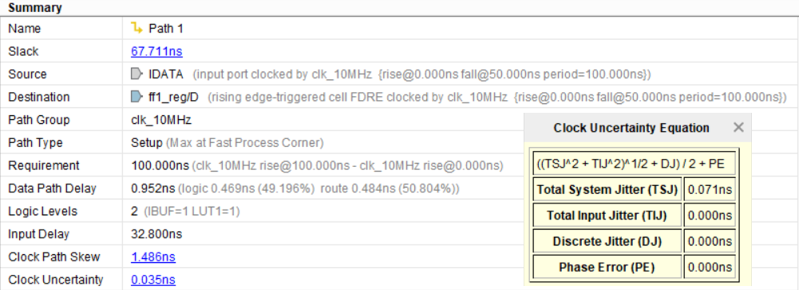
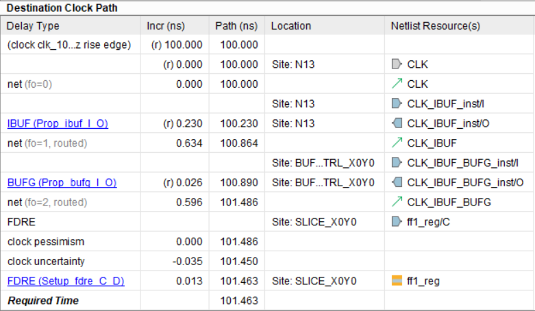
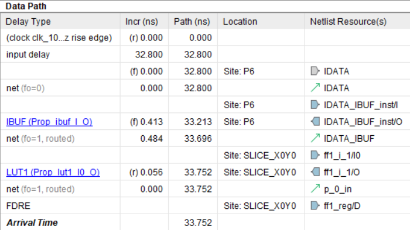
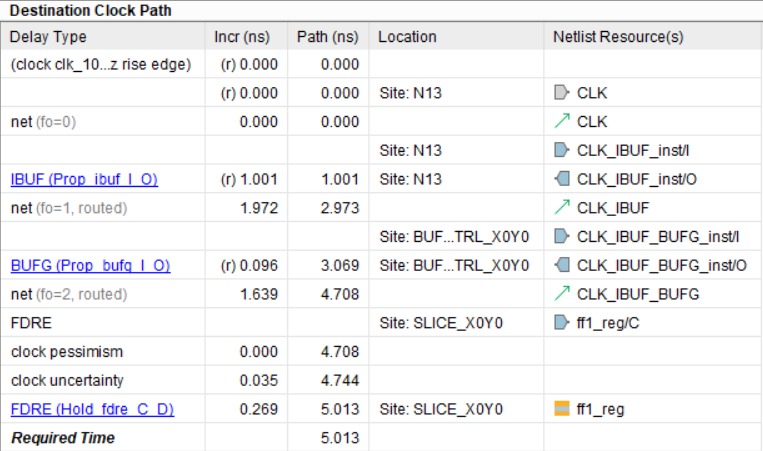
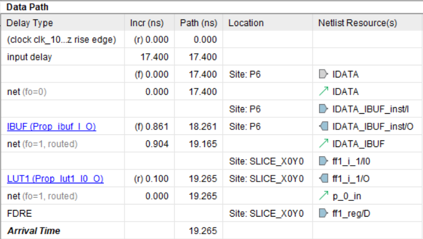
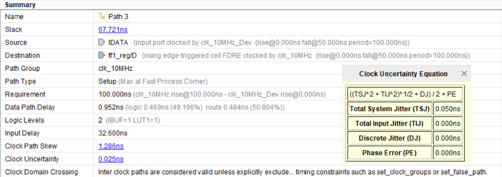
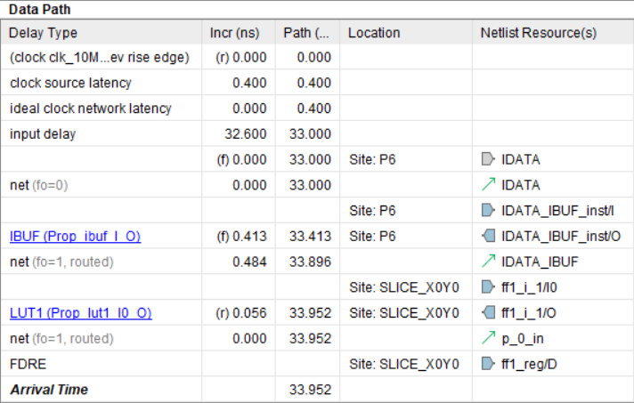
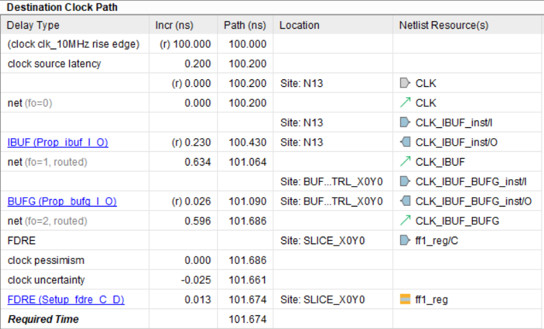
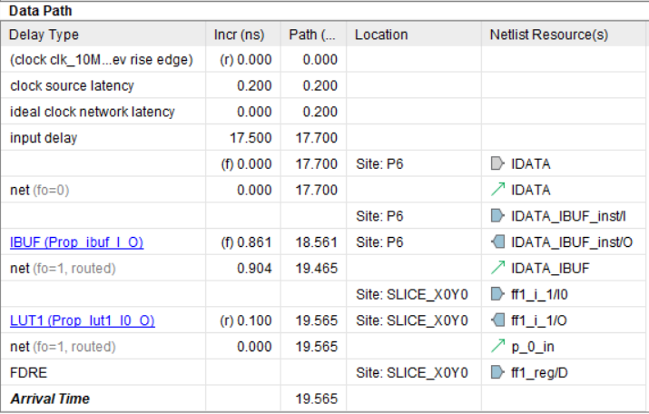
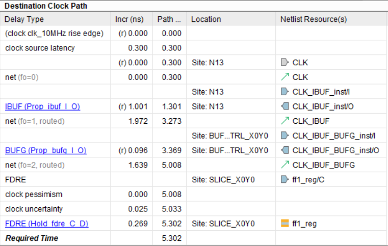

# Основы статического временного анализа. Часть 2.1: System Synchronous Input Delay Constraint

*О найденных опечатках и замечаниях просим сообщить в чате сообщества.*

## Введение

Эта статья продолжает разбор статического временного анализа для FPGA и посвящена входным сигналам, приходящим из внешнего устройства. Ниже рассматривается случай `System Synchronous`, когда и внешняя микросхема, и FPGA тактируются от одного и того же генератора на плате.

В первой части серии уже разбирался путь между двумя регистрами внутри FPGA. Здесь добавляется более практический сценарий: данные формируются внешним устройством и по дорожке платы попадают на вход FPGA. Для такого пути тоже нужно задать ограничения по `Setup` и `Hold`, иначе анализ Vivado будет неполным.

## 1. Цель временных ограничений для входных сигналов

Когда данные передаются между микросхемами на одной печатной плате, требования по времени установки и удержания должны выполняться не только внутри FPGA, но и для межкристального пути целиком.

В качестве примера будем использовать схему, где рядом с FPGA находится регистр сдвига `74HC595`, а тактовый сигнал для обоих устройств формирует внешний генератор.


_Рисунок 1. Схема соединения устройств на плате._

Такой режим называется `System Synchronous`: источник и приемник данных используют общий тактовый сигнал. Для контраста, режим `Source Synchronous` предполагает, что источник передает вместе с данными еще и собственный стробирующий такт.

Пусть внутри FPGA загружен очень простой учебный проект:

```verilog
module top (
    input  logic CLK,
    input  logic IDATA,
    output logic ODATA
);
    logic ff1, ff2;

    always_ff @(posedge CLK)
        ff1 <= ~IDATA;

    always_ff @(posedge CLK)
        ff2 <= ff1;

    assign ODATA = ~ff2;
endmodule
```

Его структура показана ниже.


_Рисунок 2. Схема FPGA проекта._

## 2. Задержки при временном анализе для входных сигналов

Путь между `74HC595` и FPGA похож на путь между двумя регистрами, но с важным отличием: запускающий триггер находится во внешнем устройстве, а защелкивающий триггер расположен уже внутри FPGA.


_Рисунок 3. Путь с задержками для входных данных и тактового сигнала._

Будем использовать следующие обозначения:

- `Todd` — задержка тактового сигнала от генератора до входа `SRCLK` микросхемы `74HC595`.
- `Tofd` — задержка тактового сигнала от генератора до входа `CLK` FPGA.
- `Tdco` — интервал между приходом такта на `74HC595` и появлением новых данных на ее выходе.
- `Tbd` — задержка распространения данных по дорожке платы между `74HC595` и FPGA.
- `Tfdd` — задержка входных данных уже внутри FPGA до защелкивающего триггера.
- `Tfcd` — задержка тактового сигнала внутри FPGA до защелкивающего триггера.
- `Tsu` — время установки триггера.
- `Th` — время удержания триггера.
- `Tclk` — период тактового сигнала.

## 3. Максимальное время распространения

Для проверки ограничения по `Setup` рассматривается наихудший случай:

- запускающий фронт приходит как можно позже;
- данные распространяются как можно медленнее;
- защелкивающий фронт приходит как можно раньше.

Время прихода запускающего фронта к регистру во внешнем устройстве:

$$
T_{sca,max} = T_{odd,max}
$$

Задержка распространения данных от внешнего регистра до входа FPGA:

$$
T_{dd,max} = T_{dco,max} + T_{bd,max}
$$

Фактическое время прихода данных ко входу FPGA:

$$
T_{da,max} = T_{odd,max} + T_{dco,max} + T_{bd,max}
$$

Удобно ввести обозначение:

$$
T_{input\_delay,max} = T_{odd,max} - T_{ofd,min} + T_{dco,max} + T_{bd,max}
$$

Тогда требуемое время прихода данных можно записать как:

$$
T_{dr,max} = T_{clk} + T_{fcd,min} - T_{su}
$$

А запас по `Setup`:

$$
Slack_{setup} = T_{dr,max} - T_{da,max}
$$

В этой статье используются оценочные значения:

- `Tbd_max = 0.6 нс`
- `Tbd_min = 0.5 нс`
- `Todd_max = 0.4 нс`
- `Todd_min = 0.2 нс`
- `Tofd_max = 0.3 нс`
- `Tofd_min = 0.2 нс`
- `Tdco_max = 32 нс`
- `Tdco_min = 17 нс`

Тактовый сигнал 10 МГц задается так:

```tcl
# ограничение на период тактового сигнала
create_clock -period 100 -name clk_10MHz [get_ports CLK]
```

Первый способ задания входного ограничения напрямую использует полную формулу для `input delay`:

```tcl
# временное ограничение для входного сигнала IDATA
set idelay_max [expr $Todd_max - $Tofd_min + $Tdco_max + $Tbd_max]
set_input_delay -clock clk_10MHz -max $idelay_max [get_ports IDATA]
```

Отчет Vivado для этого случая выглядит так:



_Рисунок 4. Общие сведения о входном пути (_`Setup`_)._



_Рисунок 5. Расчет требуемого времени прибытия данных (_`Setup`_)._



_Рисунок 6. Расчет фактического времени прибытия данных (_`Setup`_)._

Интерпретация здесь такая:

- защелкивающий фронт должен оказаться на входе FPGA в момент `100 нс`;
- с учетом `Tofd_min = 0.2 нс` соответствующий фронт на выходе генератора должен стартовать в `99.8 нс`;
- запускающий фронт для внешней микросхемы находится на период раньше, то есть в `-0.2 нс`;
- после `Todd_max = 0.4 нс` он достигает `74HC595`;
- еще через `Tdco_max + Tbd_max = 32.6 нс` данные приходят на вход FPGA.

В результате входной `input delay` получается равным `32.8 нс`, а итоговый `Slack` по `Setup` в отчете составляет примерно `67.711 нс`.

## 4. Минимальное время распространения

Для проверки ограничения по `Hold` берется другой экстремальный случай:

- запускающий фронт и данные распространяются максимально быстро;
- защелкивающий фронт распространяется максимально медленно.

Минимальная задержка входных данных задается выражением:

$$
T_{input\_delay,min} = T_{odd,min} - T_{ofd,max} + T_{dco,min} + T_{bd,min}
$$

Тогда для `Hold` ограничение задается так:

```tcl
# временное ограничение для входного сигнала IDATA
set idelay_min [expr $Todd_min - $Tofd_max + $Tdco_min + $Tbd_min]
set_input_delay -clock clk_10MHz -min $idelay_min [get_ports IDATA]
```

Временные диаграммы для этого анализа:



_Рисунок 7. Расчет требуемого времени прибытия данных (_`Hold`_)._



_Рисунок 8. Расчет фактического времени прибытия данных (_`Hold`_)._

По этим данным:

- защелкивающий фронт появляется на выходе генератора в нулевой момент времени;
- до FPGA он доходит через `Tofd_max = 0.3 нс`;
- запускающий фронт на входе `SRCLK` внешней микросхемы появляется в момент `-Tofd_max + Todd_min = -0.1 нс`;
- еще через `Tdco_min + Tbd_min = 17.5 нс` данные приходят на вход FPGA;
- итоговый `input delay` для `Hold` равен `17.4 нс`.

Подход с прямым вычислением `input_delay` работает, но анализ отчета получается менее наглядным: в одном числе смешаны и задержки платы, и рассогласование тактовых путей.

## 5. Первый способ создания временных ограничений в Vivado

Первый способ можно свести к полному `xdc`-файлу:

```tcl
# задержка между приходом тактового сигнала и появлением
# данных на выходе QH' микросхемы 74HC595
set Tdco_max 32
set Tdco_min 17

# минимальное и максимальное время распространения данных по дорожкам платы
set Tbd_max 0.6
set Tbd_min 0.5

# минимальное и максимальное время распространения тактового сигнала
# от генератора до микросхемы 74HC595
set Todd_max 0.4
set Todd_min 0.2

# минимальное и максимальное время распространения тактового сигнала
# от генератора до FPGA
set Tofd_max 0.3
set Tofd_min 0.2

# ограничение на период тактового сигнала
create_clock -period 100 -name clk_10MHz [get_ports CLK]

# временные ограничения для входного сигнала IDATA
set idelay_max [expr $Todd_max - $Tofd_min + $Tdco_max + $Tbd_max]
set_input_delay -clock clk_10MHz -max $idelay_max [get_ports IDATA]

set idelay_min [expr $Todd_min - $Tofd_max + $Tdco_min + $Tbd_min]
set_input_delay -clock clk_10MHz -min $idelay_min [get_ports IDATA]
```

Этот вариант хорош тем, что напрямую соответствует выведенным формулам.

## 6. Второй способ создания временных ограничений в Vivado

Более наглядный подход — отдельно задать тактовые задержки командой `set_clock_latency`, а в `set_input_delay` оставить только задержки распространения данных.

Сначала описывается реальный такт, приходящий в FPGA:

```tcl
# ограничение на период тактового сигнала, поступающего в FPGA
create_clock -period 100 -name clk_10MHz [get_ports CLK]

# задержки распространения тактового сигнала от генератора до FPGA
set_clock_latency -source -early $Tofd_min [get_clocks clk_10MHz]
set_clock_latency -source -late  $Tofd_max [get_clocks clk_10MHz]
```

Затем создается виртуальный тактовый сигнал для внешней микросхемы:

```tcl
# ограничение на период виртуального тактового сигнала,
# поступающего в микросхему 74HC595
create_clock -period 100 -name clk_10MHz_Dev

# задержки распространения тактового сигнала от генератора
# до микросхемы 74HC595
set_clock_latency -source -early $Todd_min [get_clocks clk_10MHz_Dev]
set_clock_latency -source -late  $Todd_max [get_clocks clk_10MHz_Dev]
```

После этого входные задержки упрощаются:

$$
T_{input\_delay,max} = T_{dco,max} + T_{bd,max}
$$

$$
T_{input\_delay,min} = T_{dco,min} + T_{bd,min}
$$

И задаются так:

```tcl
# временные ограничения для входного сигнала IDATA
set idelay_max [expr $Tdco_max + $Tbd_max]
set_input_delay -clock clk_10MHz_Dev -max $idelay_max [get_ports IDATA]

set idelay_min [expr $Tdco_min + $Tbd_min]
set_input_delay -clock clk_10MHz_Dev -min $idelay_min [get_ports IDATA]
```

Полный вариант `xdc`:

```tcl
set Tdco_max 32
set Tdco_min 17

set Tbd_max 0.6
set Tbd_min 0.5

set Todd_max 0.4
set Todd_min 0.2

set Tofd_max 0.3
set Tofd_min 0.2

create_clock -period 100 -name clk_10MHz [get_ports CLK]
set_clock_latency -source -early $Tofd_min [get_clocks clk_10MHz]
set_clock_latency -source -late  $Tofd_max [get_clocks clk_10MHz]

create_clock -period 100 -name clk_10MHz_Dev
set_clock_latency -source -early $Todd_min [get_clocks clk_10MHz_Dev]
set_clock_latency -source -late  $Todd_max [get_clocks clk_10MHz_Dev]

set idelay_max [expr $Tdco_max + $Tbd_max]
set_input_delay -clock clk_10MHz_Dev -max $idelay_max [get_ports IDATA]

set idelay_min [expr $Tdco_min + $Tbd_min]
set_input_delay -clock clk_10MHz_Dev -min $idelay_min [get_ports IDATA]
```

Отчеты Vivado для этого способа:



_Рисунок 9. Общие сведения о входном пути (_`Setup`_)._



_Рисунок 10. Расчет фактического времени прибытия данных (_`Setup`_)._



_Рисунок 11. Расчет требуемого времени прибытия данных (_`Setup`_)._



_Рисунок 12. Расчет фактического времени прибытия данных (_`Hold`_)._



_Рисунок 13. Расчет требуемого времени прибытия данных (_`Hold`_)._

Этот способ обычно удобнее: тактовые задержки платы задаются явно и отдельно, а `input delay` описывает только задержку данных между внешним устройством и входом FPGA.

## 7. Несовпадающие значения Slack

Можно заметить, что для двух способов значения `Slack` отличаются на `0.01 нс`: примерно `67.711 нс` и `67.721 нс`. Причина в том, как в отчетах учитывается `clock uncertainty`.

Неопределенность связана с джиттером тактового сигнала. Для суммарного системного джиттера используется обозначение `Ttsj`, а сам он складывается из вклада источника и приемника. По умолчанию для внешнего тактового сигнала Vivado использует `Tsj = 0.05 нс`.

В первом способе оба такта считаются реальными, поэтому uncertainty выходит больше. Во втором один из тактов виртуальный, и его джиттер считается нулевым, из-за чего итоговое значение slightly меньше. Если требуется сделать результаты полностью совпадающими, это можно настроить командами `set_system_jitter` и `set_input_jitter`.

## Заключение

Для интерфейса `System Synchronous` входные ограничения можно задавать двумя путями:

1. Сразу вычислять полный `input delay`, включая рассогласование тактовых путей.
2. Отдельно описывать задержки тактов через `set_clock_latency`, а в `set_input_delay` оставлять только задержку данных.

На практике второй вариант обычно удобнее для чтения и отладки: он лучше соответствует физической картине на плате и делает отчеты Vivado более прозрачными.

## Ссылки

1. [Основы статического временного анализа. Часть 1: Period Constraint](timings1_intro.md)
2. [Datasheet 74HC595](https://www.ti.com/lit/ds/symlink/sn74hc595.pdf)
3. [How to Calculate Trace Length from Time Delay Value for High-speed Signals](https://www.zuken.com/en/blog/how-to-calculate-trace-length-from-time-delay-value-for-high-speed-signals/)
4. [Using Constraints (UG903)](https://docs.amd.com/r/en-US/ug903-vivado-using-constraints)
