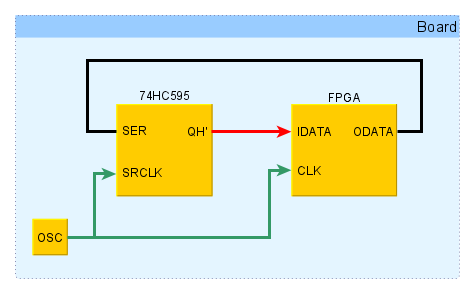
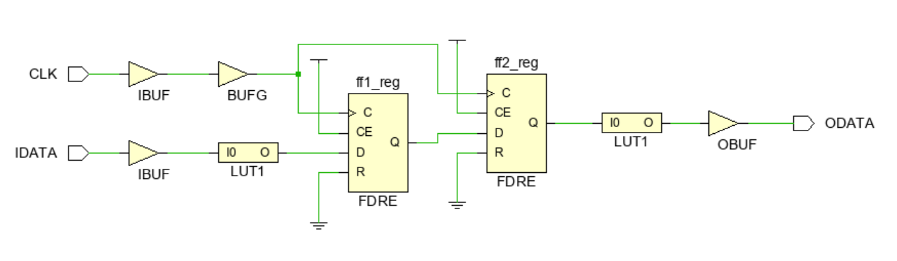
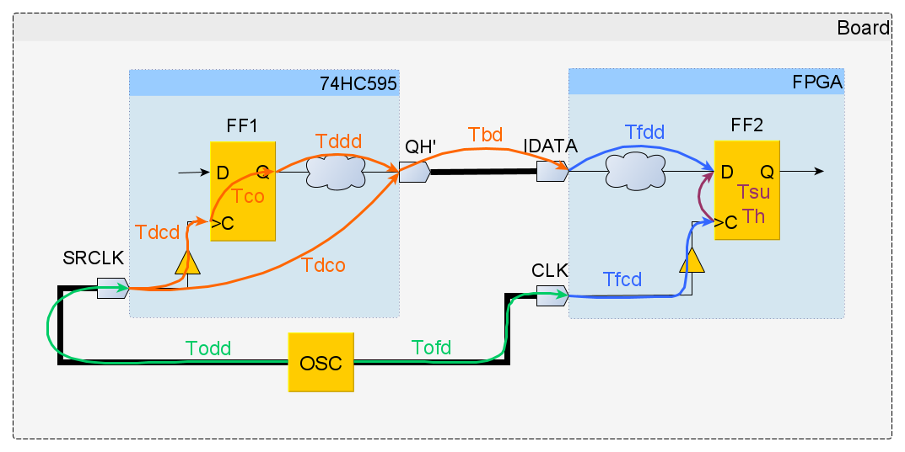

# Основы статического временного анализа. Часть 2.1: System Synchronous Input Delay Constraint

*О найденных опечатках и замечаниях просим сообщить в чате сообщества.*

## Введение

Данная статья является продолжением серии статей по временным ограничениям в FPGA. Главная цель – познакомить начинающих разработчиков с основами статического временного анализа. Далее будет рассмотрен анализ передачи данных из FPGA во внешнее устройство и показано два способа создания ограничений для выходных сигналов.

В первой части серии уже разбирался путь между двумя регистрами внутри FPGA. Здесь добавляется более практический сценарий: данные формируются внешним устройством и по дорожке платы попадают на вход FPGA. Для такого пути тоже нужно задать ограничения по `Setup` и `Hold`, иначе анализ Vivado будет неполным.

## 1. Цель временных ограничений для выходных сигналов

В цифровых синхронных устройствах данные передаются между двумя триггерами, которые разделены комбинационной логикой. Ранее в [[1]](./timings1_intro.md) был представлен временной анализ для входных сигналов. В данной статье будут рассмотрены ограничения для выходных сигналов. Часть параграфов будут совпадать с материалом, представленным в [[1]](./timings1_intro.md). Это сделано намеренно чтобы данные работы можно было читать независимо друг от друга.

Обычно обрабатываемые данные пересылаются между FPGA и другими микросхемами, расположенными на той же печатной плате. Эти пути передачи должны удовлетворять ограничениям по _Setup_ и _Hold_, чтобы плата как единое целое могла работать корректно. Поэтому практически всегда для выходных сигналов FPGA требуется вводить временные ограничения.

В качестве примера будем рассматривать устройство, схема которого показана на рисунке 1. Помимо FPGA на плате присутствует микросхема 74HC595 [3], которая представляет из себя обычный регистр сдвига и часто поставляется в составе обучающих наборов для Arduino. Также на плате располагается генератор (OSC), формирующий тактовый сигнал для FPGA и 74HC595.

Данная конфигурация, при которой тактовый сигнал для источника и приемника данных поступает от внешнего генератора, называется System Synchronous. Другой вариант, когда источник помимо данных также формирует тактовый сигнал, называется Source Synchronous.

На рисунке 1 отмечены только те ножки микросхемы 74HC595, которые будут рассматриваться в дальнейшем. Ножка SER соответствует входу регистра сдвига, ножка QH’ – его выходу. Регистр сдвига тактируется сигналом, который поступает на ножку SRCLK. В дальнейшем микросхему 74HC595 для краткости будем иногда называть Device. Далее будет представлен временной анализ передачи данных с выхода ODATA FPGA на вход SER 74HC595. На рисунке 1 данный путь отмечен красным цветом.



_Рисунок 1. Схема соединения устройств на плате._

Также пусть в FPGA загружен простой проект, состоящий из двух триггеров и двух LUT, которые реализуют логическое отрицание. Схема проекта показана на рисунке 2.




_Рисунок 2. Схема FPGA проекта._

Описание проекта на System Verilog представлено ниже:

```verilog
module top (
    input  logic CLK,
    input  logic IDATA,
    output logic ODATA
);    
    logic ff1, ff2;
    
    always_ff@(posedge CLK)
       ff1 <= ~IDATA;
       
    always_ff@(posedge CLK)
       ff2 <= ff1;
       
   assign ODATA = ~ff2;             
endmodule
```

Данный проект не имеет какой-либо практической ценности, однако на его примере можно продемонстрировать, как проводится временной анализ для выходных сигналов.

## 2. Задержки при временном анализе для входных сигналов

Анализ передачи данных между FPGA и Device мало отличается от случая, рассмотренного в [2] для двух триггеров внутри FPGA. Особенностью является то, что запускающий триггер располагается в одном устройстве, а защелкивающий в другом. На рисунке 3 показан анализируемый путь, на который нанесены задержки для данных и тактового сигнала.



_Рисунок 3. Путь с задержками для входных данных и тактового сигнала._

Ниже даны определения задержек, представленных на рисунке 3.

- `Todd` (**O**sc to **D**evice **D**elay)  — задержка тактового сигнала от генератора до входа `SRCLK` микросхемы `74HC595`.
- `Tofd` (**O**sc to **F**PGA **D**elay) — задержка тактового сигнала от генератора до входа `CLK` FPGA.
- `Tdco` (**D**evice **C**lock **D**elay)  — интервал между приходом такта на `74HC595` и появлением новых данных на ее выходе.
- `Tbd` (**B**oard **D**elay) — задержка распространения данных по дорожке платы между `74HC595` и FPGA.
- `Tfdd` (**D**evice **D**ata **D**elay) — задержка входных данных уже внутри FPGA до защелкивающего триггера.
- `Tfcd` (**F**PGA **D**ata **D**elay)  — задержка тактового сигнала внутри FPGA до защелкивающего триггера.
- `Tsu` (**S**et**U**p time)  —  время установки защелкивающего триггера.
- `Th` — время удержания защелкивающего триггера.
- `Tco`(**F**PGA **C**lock **D**elay)  —  интервал времени между приходом фронта на тактовый вход триггера и появлением данных на его выходе Q.

Период тактового сигнала будем обозначать `Tclk`. Оранжевым и зеленым цветом на рисунке 3 представлены задержки для участков пути, которые располагаются вне FPGA. Данные задержки необходимо указать временному анализатору Vivado.

## 3. Максимальное время распространения

Для начала рассмотрим, каким образом выполняется анализ для проверки ограничения на максимальное время распространения (Setup). Напомним, что временной анализ по Setup всегда проводится для самого пессимистичного случая, которому соответствует максимально задержанный запускающий фронт, максимально медленное распространение данных и максимально быстро распространяющийся защелкивающий фронт.

Сначала найдем фактическое время прибытия данных ко входу защелкивающего триггера, расположенного внутри микросхемы 74HC595. Будем считать, что запускающий фронт появляется в нулевой момент времени. Уравнения для расчета представлены ниже (см. рисунок 3):

- Время прибытия фронта к запускающему триггеру (**S**ource **С**lock **A**rrival time):

$$
T_{sca\_max} = T_{ofd\_max} + T_{fcd\_max}
$$

- Задержка распространения данных (**D**ata **D**elay):

$$
T_{dd\_max} = T_{co\_max} + T_{ddd\_max}+ T_{bd\_max}+ T_{fdd\_max}
$$

-  Время прибытия данных на вход защелкивающего триггера внутри микросхемы 74HC595 (**D**ata **A**rrival time):

$$
T_{da\_max} = T_{sca\_max} + T_{dd\_max}
$$

Подставив предыдущие результаты в уравнение для $T_{da\_max}$, получим:


$$
T_{da\_max} = T_{odd\_max} + T_{dcd\_max} + T_{co\_max} + T_{ddd\_max}+ T_{bd\_max}+ T_{fdd\_max}
$$

Введем обозначение

$$
T_{dco} = T_{dcd} + T_{co} + T_{ddd}
$$

Задержка $T_{dco}$ соответствует интервалу времени между приходом фронта на тактовый вход SRCLK микросхемы 75HC595 и появлением данных на ее выходе QH’. Уравнение для **D**ata **A**rrival time можно записать в виде:

$$
T_{da\_max} = T_{odd\_max} + T_{dco\_max} + T_{bd\_max} + T_{fdd\_max}
$$

Теперь вычислим требуемое время прибытия данных. Защелкивающий фронт появляется через один такт после запускающего, поэтому ко времени прибытия фронта добавлен один период тактового сигнала.

- Время прибытия фронта к защелкивающему триггеру внутри микросхемы 74HC595 (**D**estination **C**lock **A**rrival time):

$$
T_{dca\_min} = T_{ofd\_min} + T_{fcd\_min} + T_{clk}
$$

- Требуемое время прибытия данных (Data Required time):

$$
T_{dr\_min} = T_{dca\_min} - T_{su} = T_{ofd\_min} + T_{fcd\_min} + T_{clk} - T_{su}
$$

В предыдущем уравнении учитывается, что данные на входе защелкивающего триггера должны быть стабильны в течении времени Tsu до прихода фронта тактового сигнала.

При анализе по Setup величина запаса (Slack) вычисляется по формуле:
$$
Slack = T_{dr\_min} - T_{da\_max}
$$
Если Slack принимает отрицательное значение, то это указывает, что данные приходят на вход защелкивающего триггера позже, чем требуется. То есть, ограничение по Setup нарушено. Используя ранее полученные уравнения, можно записать полное выражение для расчета Slack: 

\begin{equation}
Slack = T_{clk} + T_{fcd\_min} - T_{fdd\_max} - T_{su} + T_{ofd\_min} - T_{odd\_max} - T_{dco\_max} - T_{bd\_max}
\tag{1}
\label{eq:1}
\end{equation}

## 4. Минимальное время распространения
Теперь рассмотрим, как выполняется анализ для проверки ограничения на минимальное время распространения (Hold). При анализе по Hold считается, что задержки для запускающего фронта и данных имеют минимальное значение, а для защелкивающего фронта – максимальное. 

Расчет фактического времени прибытия данных представлен ниже:
- Время прибытия фронта к триггеру внутри Device  (Source Сlock Arrival time):  

$$
T_{sca\_min} = T_{odd\_min} + T_{dcd\_min}
$$

- Задержка распространения данных (Data Delay):

$$
T_{dd\_min} = T_{co\_min} + T_{ddd\_min} + T_{bd\_min} + T_{fdd\_min}
$$

- Время прибытия данных к триггеру внутри FPGA (Data Arrival time):

$$
T_{da\_min} = T_{sca\_min} + T_{dd\_min} = T_{odd\_min} + T_{dco\_min} + T_{bd\_min} + T_{fdd\_min}
$$

где, как и ранее,

$$
T_{dco} = T_{dcd} + T_{co} + T_{ddd}
$$

Далее представлены уравнения для вычисления требуемого времени прибытия данных:

- Время прибытия фронта к защелкивающему триггеру внутри FPGA (Destination Clock Arrival time):
$$
T_{dca\_max} = T_{ofd\_max} + T_{fcd\_max}
$$
- Требуемое время прибытия данных (Data Required time):
$$
T_{dr\_max} = T_{dca\_max} + T_h = T_{ofd\_max} + T_{fcd\_max} + T_h
$$

Напомним, что защелкивающий фронт для предыдущих данных появляется в тот же момент времени, что и запускающий фронт для следующих данных. По этой причине в задержке распространения Tdca отсутствует слагаемое, равное периоду тактового сигнала. Также отметим, что слагаемое Th в уравнении для Tdr_max учитывает, что данные не должны изменяться в течении времени удержания после защелкивающего фронта.

Уравнение для расчета Slack при анализе по Hold имеет вид:
$$
Slack = T_{da\_min} - T_{dr\_max}
$$

Используя полученные выше результаты, выражение для Slack можно представить в виде: 
\begin{equation}
Slack = T_{fdd\_min} - T_{fcd\_max} - T_h + T_{odd\_min} - T_{ofd\_max} + T_{dco\_min} + T_{bd\_min}
\tag{2}
\label{eq:2}
\end{equation}

## 5. Первый способ создания временных ограничений в Vivado
Перейдем от теории к практике и рассмотрим первый способ создания временных ограничений для входных сигналов. Для начала разберемся с ограничениями для анализа по Setup. 

В уравнении \(\ref{eq:1}\), слагаемые, выделенные зеленым и оранжевым цветом, неизвестны временному анализатору Vivado, так как они описывают задержки для участков пути вне FPGA. Также неизвестным является значение периода Tclk. Создание ограничения на период тактового сигнала с помощью команды create_clock было рассмотрено в [1]. 

Для определенности будем считать, что напряжение источника питания микросхемы 74HC595 равно 4.5 В. Из таблицы 6.6 datasheet для 74HC595 [2] находим, что в этом случае её максимальная рабочая частота равна 31 МГц. Пусть требуется, чтобы плата на рисунке 1 могла работать при частоте тактового генератора (OSC) равной 10 МГц. Тогда ограничение на период тактового сигнала можно записать в виде:
```tcl
# ограничение на период тактового сигнала
create_clock -period 100 -name clk_10MHz [get_ports CLK]
```
Данная команда объявляет тактовый сигнал clk_10MHz с периодом 100 нс, который поступает в FPGA через ножку CLK. Объединим все оставшиеся неизвестные слагаемые из уравнения \(\ref{eq:1}\), в одну переменную `input_delay_max`. Тогда выражение для Slack можно переписать в виде:
$$
Slack = T_{clk} - input\_delay\_max + T_{fcd\_min} - T_{fdd\_max} - T_{su}
$$

где

\begin{equation}
input\_delay\_max = T_{odd\_max} - T_{ofd\_min} + T_{dco\_max} + T_{bd\_max}
\tag{3}
\label{eq:3}
\end{equation}

В уравнении \(\ref{eq:3}\) слагаемые Todd_max, Tofd_min и Tbd_max описывают задержки, обусловленные распространением сигнала по дорожкам печатной платы. Их значения зависят от многих факторов, например, материала подложки, длины дорожек, типа дорожек (полосковые, микрополосковые и т.д.).

Для каждого типа дорожек существуют приближенные выражения для вычисления скорости распространения сигнала. Зная скорость сигнала и длину дорожки, можно оценить задержку распространения. Примеры приближенных расчетов для различных типов дорожек можно найти в [3].

Будем считать, что мы смогли оценить минимальные и максимальные задержки распространения сигналов по дорожкам печатной платы. В качестве примера примем следующие значения в наносекундах: Tbd_max = 0.6, Tbd_min = 0.5, Todd_max = 0.4, Todd_min = 0.2, Tofd_max = 0.3 и Tofd_min = 0.2. Значения задержек можно указать в файле с временными ограничениями (xdc-файл) в следующем виде:

```tcl
# минимальное и максимальное время распространения данных по
# дорожкам платы
set Tbd_max 0.6
set Tbd_min 0.5

# минимальное и максимальное время распространения тактового сигнала
# от генератора до микросхемы 74HC595 
set Todd_max 0.4
set Todd_min 0.2

# минимальное и максимальное время распространения тактового сигнала
# от генератора до FPGA
set Tofd_max 0.3
set Tofd_min 0.2
```

Рассмотрим задержку Tdco из уравнения \(\ref{eq:3}\), которая соответствует интервалу времени между приходом фронта на тактовый вход SRCLK микросхемы 75HC595 и появлением данных на ее выходе QH’. Ее значение можно получить из таблицы 6.7 datasheet для 74HC595 [2]. Данная задержка обозначена как tpd и при напряжении питания 4.5 В может изменяться от 17 до 32 нс. Эти значения также записываются в xdc-файл:
```tcl
# задержка между приходом тактового сигнала и появлением
# данных на выходе QH' микросхемы 74HC595 
set Tdco_max 32
set Tdco_min 17
```

Теперь можно создать временное ограничение на входной сигнал для анализа по Setup. Для этого в файл с ограничениями нужно внести следующие команды [4]:  
```tcl
# временное ограничение для входного сигнала IDATA
set idelay_max [expr $Todd_max - $Tofd_min + $Tdco_max + $Tbd_max]
set_input_delay -clock clk_10MHz -max $idelay_max [get_ports IDATA]
```

В первой строке объявлена переменная `idelay_max`, значение которой приравнивается `input_delay_max` из уравнения \(\ref{eq:3}\). Далее с помощью команды `set_input_delay` создается ограничение для входного сигнала. 

Опция `-max $idelay_max` задает задержку для анализа по Setup. Конструкция `[get_ports IDATA]` указывает, что ограничение накладывается на входной сигнал, поступающий в FPGA через ножку `IDATA`. 

Важно отметить, что анализатору Vivado необходимо указать, каким сигналом тактируется запускающий триггер, так как он находится вне FPGA. Это делается с помощью опции `-clock clk_10MHz`. Данный тактовый сигнал был создан ранее с помощью команды `create_clock`. Защелкивающий триггер располагается внутри FPGA, поэтому временному анализатору его тактовый сигнал известен.

Аналогичным образом создаются ограничения для анализа по Hold. Объединив все неизвестные слагаемые в уравнении \(\ref{eq:2}\) в одну переменную, выражение для Slack можно записать в виде:

$$
Slack = input\_delay\_min + T_{fdd\_min} - T_{fcd\_max} - T_h
$$
где

\begin{equation}
 input\_delay\_min = T_{odd\_min} - T_{ofd\_max} + T_{dco\_min} + T_{bd\_min}
\tag{4}
\label{eq:4}
\end{equation}

Команды, которые требуется добавить в xdc-файл, представлены ниже: 
```tcl
# временное ограничение для входного сигнала IDATA
set idelay_min [expr $Todd_min - $Tofd_max + $Tdco_min + $Tbd_min]
set_input_delay -clock clk_10MHz -min $idelay_min [get_ports IDATA]
```

Как и ранее, сначала объявляется переменная, значение которой равно input_delay_min, после чего с помощью команды set_input_delay создается временное ограничение. Опция -min указывает, что ограничение предназначено для проведения анализа по Hold. Полное содержимое xdc-файла представлено ниже:
```tcl
# задержка между приходом тактового сигнала и появлением 
# данных на выходе QH' микросхемы 74HC595 
set Tdco_max 32
set Tdco_min 17

# минимальное и максимальное время распространения данных по
# дорожкам платы
set Tbd_max 0.6
set Tbd_min 0.5

# минимальное и максимальное время распространения тактового сигнала
# от генератора до микросхемы 74HC595 
set Todd_max 0.4
set Todd_min 0.2

# минимальное и максимальное время распространения тактового сигнала 
# от генератора до FPGA
set Tofd_max 0.3
set Tofd_min 0.2

# ограничение на период тактового сигнала
create_clock -period 100 -name clk_10MHz [get_ports CLK]

# временные ограничения для входного сигнала IDATA
set idelay_max [expr $Todd_max - $Tofd_min + $Tdco_max + $Tbd_max]
set_input_delay -clock clk_10MHz -max $idelay_max [get_ports IDATA]

set idelay_min [expr $Todd_min - $Tofd_max + $Tdco_min + $Tbd_min]
set_input_delay -clock clk_10MHz -min $idelay_min [get_ports IDATA]
```

Рассмотрим, как введенные ограничения будут отражены во временных отчетах, полученных после размещения и трассировки проекта. На рисунке 4 представлен раздел Summary для анализа по Setup, в котором указан источник сигнала (ножка IDATA), защелкивающий триггер (ff1_reg), задержка данных внутри FPGA (Data Path Delay) и количество уровней логики (Logic Levels). Также можно увидеть полученный Slack, расфазировку (Clock Path Skew) и неопределенность (Clock Uncertainty) тактового сигнала.