# Основы статического временного анализа. Часть 5: False Path Constraint.

>*О найденных опечатках и замечаниях просим сообщить

## Введение.

В данной статье представлен временной анализ передачи сигналов между двумя тактовыми доменами. Показано несколько способов исключения путей из временного анализа. Рассмотрены инструменты Vivado, предназначенные для проверки корректности передачи данных между тактовыми доменами. 

## 1. Пересечение тактовых доменов.

В предыдущих работах серии был представлен временной анализ передачи данных между двумя триггерами с общим тактовым сигналом. Теперь же будет рассмотрен случай, когда запускающий и защелкивающий триггеры имеют разные тактовые сигналы. Данная статья частично опирается на материал, рассмотренный ранее в [1]. Предполагается, что читатель уже знаком с такими понятиями, как ограничение на максимальное (Setup) и минимальное (Hold) время распространения сигнала, запас (Slack) и т.д. 

Для начала введем несколько определений. Множество триггеров, которые тактируются одним и тем же сигналом, будем называть тактовым доменом (Clock Domain). Пересечение тактовых доменов (Clock Domain Cross – CDC) возникает в случае, когда при передаче данных запускающий триггер находится в одном домене, а защелкивающий – в другом. 

Рассмотрим, как выполняется временной анализ при пересечении тактовых доменов. На рисунке 1 показан путь, на который нанесены задержки для данных и тактовых сигналов. Передающий триггер `FF1` тактируется сигналом `CLK_1`, а приёмный триггер `FF2` – сигналом `CLK_2`.

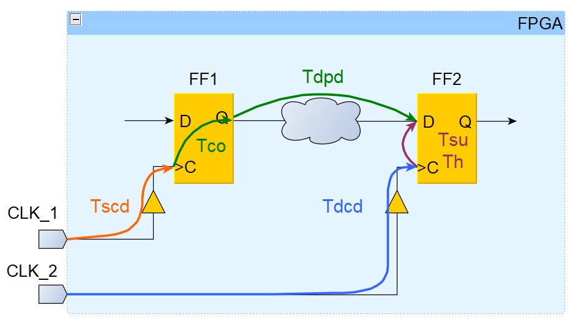

_Рисунок 1. Путь с задержками для данных и тактовых сигналов._

Ниже даны определения задержек, представленных на рисунке 1. 

- $T_{scd}$ (_Source Clock Delay_) – задержка запускающего тактового сигнала от ножки CLK_1 FPGA до тактового входа триггера FF1;
- $T_{dcd}$ (_Destination Clock Delay_) – задержка защелкивающего тактового сигнала от ножки CLK_2 FPGA до тактового входа триггера FF2;
- $T_{co}$ (_Clock to Output_) – интервал времени между приходом фронта на тактовый вход триггера и появлением данных на его выходе Q;
- $T_{dpd}$ (_Data Propagation Delay_) – задержка распространения данных по соединениям и через комбинационную логику;
- $T_{su}$ (_SetUp time_) – время установки защелкивающего триггера; 
- $T_{h}$ (_Hold time_) – время удержания защелкивающего триггера. 

Для начала рассмотрим, каким образом выполняется анализ для проверки ограничения на максимальное время распространения (Setup). Пусть запускающий фронт появляется на ножке `CLK_1` FPGA в момент времени `Tclk_1_su`. Запишем уравнения для расчета фактического времени прибытия данных (см. рисунок 1): 

- Время прибытия запускающего фронта к триггеру `FF1` (_Source Сlock Arrival time_):

$$
T_{sca\_max} = T_{clk\_1\_su} + T_{scd\_max}
$$

- Время прибытия данных на вход триггера `FF2` (_Data Arrival time_):

$$
T_{da\_max} = T_{clk\_1\_su} + T_{scd\_max} + T_{co\_max} + T_{dpd\_max}
$$

Далее, считая, что защелкивающий фронт появляется на ножке `CLK_2` FPGA в момент времени `Tclk_2_su`, получим уравнения для требуемого времени прибытия данных ко входу триггера FF2:

- Время прибытия защелкивающего фронта к триггеру `FF2` (_Destination Clock Arrival time_):

$$
T_{dca\_min} = T_{clk\_2\_su} + T_{dcd\_min}
$$

- Требуемое время прибытия данных (_Data Required time_):

$$
T_{dr\_min} = T_{clk\_2\_su} + T_{dcd\_min} - T_{su}
$$

При анализе по Setup значение запаса рассчитывается с помощью следующего выражения:

$$
Slack = T_{dr\_min} - T_{da\_max}
$$

Подставим в него найденные ранее результаты и получим: 

$$
Slack = \Delta T_{su} + T_{dcd\_min} - T_{scd\_max} - T_{co\_max} - T_{dpd\_max} - T_{su}
$$

где $\Delta T_{su}$ – интервал времени между появлением запускающего фронта на ножке `CLK_1` и защелкивающего фронта на ножке `CLK_2`:

\begin{equation}
\Delta T_{su} = T_{clk\_2\_su} - T_{clk\_1\_su}
\tag{1}
\label{eq:1}
\end{equation}

Теперь рассмотрим, как выполняется анализ для проверки ограничения на минимальное время распространения (Hold). Пусть запускающий фронт появляется на ножке `CLK_1` в момент времени $T_{clk\_1\_h}$. Напомним, что при анализе по Hold защелкивающим фронтом является тот, с помощью которого триггер `FF2` принимает предыдущие данные [1]. Будем считать, что этот фронт появляется на ножке `CLK_2` в момент времени $T_{clk\_2\_h}$. 

Для начала получим уравнения для фактического времени прибытия данных:

- Время прибытия запускающего фронта к триггеру `FF1` (_Source Сlock Arrival time_):

$$
T_{sca\_min} = T_{clk\_1\_h} + T_{scd\_min}
$$

- Время прибытия данных на вход триггера `FF2` (_Data Arrival time_):

$$
T_{da\_min} = T_{clk\_1\_h} + T_{scd\_min} + T_{co\_min} + T_{dpd\_min}
$$

Далее, запишем уравнения для требуемого времени прибытия данных: 

- Время прибытия защелкивающего фронта к триггеру `FF2` (`Destination Clock Arrival time`):

$$
T_{dca\_max} = T_{clk\_2\_h} + T_{dcd\_max}
$$

- Требуемое время прибытия данных (`Data Required time`):

$$
T_{dr\_max} = T_{clk\_2\_h} + T_{dcd\_max} + T_h
$$

Уравнение для расчета Slack при анализе по Hold имеет вид:

$$
Slack = T_{da\_min} - T_{dr\_max}
$$

Учитывая предыдущие результаты, можем записать выражение для Slack в следующем виде: 

$$
Slack = T_{scd\_min} + T_{co\_min} + T_{dpd\_min} - \Delta T_h - T_{dcd\_max} - T_h
$$

где $\Delta T_h$ – интервал времени между появлением запускающего и защелкивающего фронтов:

\begin{equation}
\Delta T_h = T_{clk\_2\_h} - T_{clk\_1\_h}
\tag{2}
\label{eq:2}
\end{equation}

В уравнениях для $Slack$, полученных ранее, $\Delta T_{su}$ и $\Delta T_h$ являются единственными слагаемыми, величины которых не известны временному анализатору после размещения и трассировки проекта. Эти значения должны рассчитываться исходя из временных соотношений между фронтами тактовых сигналов `CLK_1` и `CLK_2`. 

Для начала рассмотрим способ вычисления $\Delta T_{su}$ [2]. Как и всегда временной анализ проводится для самого пессимистичного случая. При анализе по Setup этому соответствует минимальное значение $\Delta T_{su}$, так как данное слагаемое входит в уравнение для $Slack$ c положительным знаком.  В качестве примера будем считать, что период сигнала `CLK_1` равен 6 нс, а период `CLK_2` – 4 нс. Также пусть в нулевой момент времени формируются фронты обоих тактовых сигналов (см. рисунок 2).

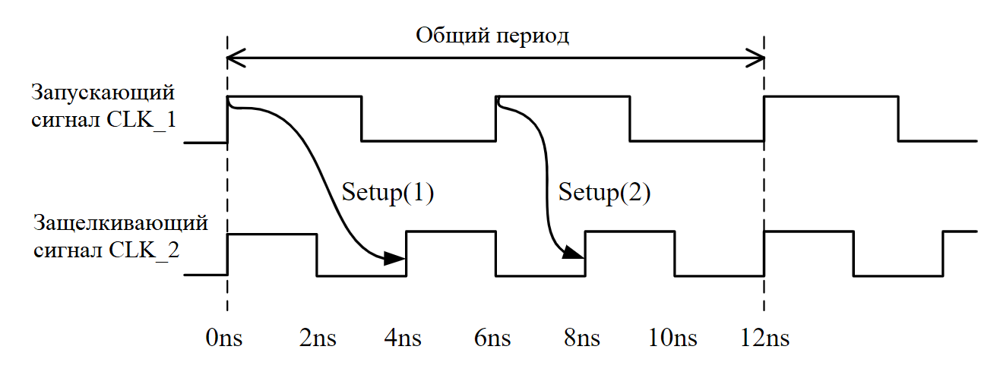

_Рисунок 2. Временная диаграмма сигналов для анализа по Setup._

Для расчета $\Delta T_{su}$ временной анализатор поочередно выбирает один из фронтов сигнала `CLK_1` и рассматривает его в качестве запускающего. То есть, проверяются случаи, когда запускающий фронт формируется в момент времени 0 нс, 6 нс, 12 нс и так далее. Затем для каждого запускающего фронта `CLK_1` находится соответствующий защелкивающий фронт сигнала `CLK_2`. При этом ищется ближайший фронт `CLK_2`, который появляется строго после запускающего фронта `CLK_1`. 

Например, как видно из рисунка 2, первому фронту `CLK_1` (0 нс) соответствует второй фронт `CLK_2` (4 нс), а второму фронту `CLK_1` (6 нс) –третий фронт `CLK_2` (8 нс). Для каждой такой пары по формуле \(\ref{eq:1}\) рассчитывается значение $\Delta T_{su}$. В нашем примере для первой пары фронтов получаем $\Delta T_{su}$ = 4 – 0 = 4 нс. Для второй пары находим, что $\Delta T_{su}$ = 8 – 6 = 2 нс. После 12 нс временная диаграмма сигналов будет повторяться, поэтому для третьего фронта `CLK_1` опять получим, что $\Delta T_{su}$ = 4 нс (см. рисунок 2). Интервал времени, через который повторяются временные соотношения между двумя тактовыми сигналами, называют общим периодом. 

После того, как временной анализатор найдет общий период и рассмотрит на нем все фронты `CLK_1`, он останавливается и находит минимальное значение $\Delta T_{su}$. В нашем примере это 2 нс. Именно эта величина в дальнейшем будет использоваться в расчете $Slack$ при анализе по Setup. Отметим также, что возможна ситуация, при которой временной анализатор не сможет найти общий период в течение 1000 тактов сигнала `CLK_1`. В этом случае он остановится и будет использовать минимальное значение $\Delta T_{su}$, обнаруженное в течение этих 1000 тактов. 

Теперь рассмотрим, как рассчитывается значение $\Delta T_h$ для анализа по Hold. На предыдущем этапе при вычислении $\Delta T_{su}$, анализатор нашел все пары фронтов `CLK_1` и `CLK_2`, появляющиеся в течение общего периода. Для каждой такой пары должны быть проверены два условия [2]:

- данные, которые передаются по запускающему фронту `CLK_1` не должны быть приняты фронтом CLK_2, который является предыдущим по отношению к текущим защелкивающему фронту `CLK_2`;

- данные, которые передаются фронтом `CLK_1`, следующим после запускающего, не должны быть приняты текущим защелкивающим фронтом `CLK_2`.

Для примера изучим рисунок 3, на котором первая пара фронтов, полученная при анализе по Setup, обозначена как S1. Первое условие для S1 соответствует стрелке `H1a`. Данные, запущенные фронтом `CLK_1` в нулевой момент времени, не должны быть приняты фронтом `CLK_2`, который появляется также в нулевой момент времени. Второму условию соответствует стрелка H1b. Следующий фронт `CLK_1` относительно пары `S1` формируется через 6 нс. Данные, которые он запустит, не должны быть приняты защелкивающим фронтом из `S1`, который появится в момент времени 4 нс.

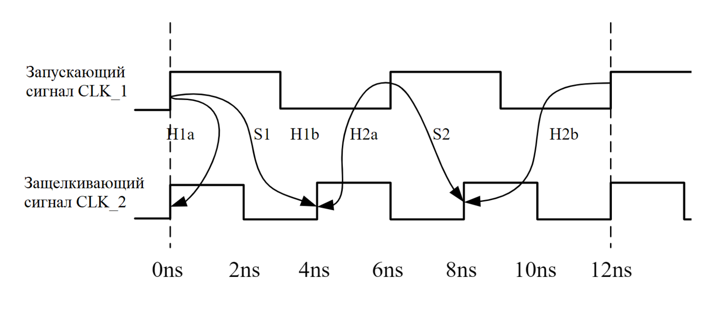

_Рисунок 3. Временная диаграмма сигналов для анализа по Hold._

Аналогичным образом проверяются условия для второй пары фронтов S2, полученной при анализе по Setup. На рисунке 3 они обозначены стрелкам H2a (она же H1b) и H2b. На интервале времени общего периода для каждого условия по формуле \(\ref{eq:2}\) вычисляется значение $\Delta T_h$. В нашем примере для условия `H1a` величина $\Delta T_h$ равна $0 – 0 = 0 нс$. Для `H2a` и `H1b` получаем, что $\Delta T_h = 4 – 6 = –2 нс$, а для `H2b` – $\Delta T_h = 8 – 12 = –4 нс$. Самому пессимистичному случаю при анализе по Hold соответствует максимальное значение $\Delta T_h$, так как в уравнение для $Slack$ это слагаемое входит с отрицательным знаком. Для нашего примера максимальное значение $\Delta T_h$ равно нулю, что соответствует условию `H1a` (см. рисунок 3).

Чтобы временной анализатор мог провести свои расчеты, ему необходимо указать периоды и начальные фазы тактовых сигналов. Зная эти параметры, он вычислит общий период и найдет минимальное значение $\Delta T_{su}$ и максимальное значение $\Delta T_h$.  

## 2. Асинхронные тактовые сигналы.

Как было показано выше, для проведения временного анализа при пересечении доменов необходимо знать точные временные соотношения между тактовыми сигналами. Однако, это возможно далеко не всегда. Например, если тактовые сигналы формируются из двух разных генераторов, то их начальные фазы и положения фронтов друг относительно друга неизвестны.

С точки зрения временных соотношений пары тактовых сигналов можно классифицировать следующим образом [3]:
- асинхронные – формируются разными генераторам;
- мезохронные – формируются из одного генератора, но в процессе распространения из-за различных факторов их временные соотношения становятся неизвестными; 
- синхронные – формируются из одного генератора, и их временные соотношения точно известны.

Мезохронными, например, можно считать тактовые сигналы, которые формируются одним внешним генератором и поступают на разные тактовые ножки FPGA. При распространении по дорожкам платы в задержки этих сигналов может вноситься неопределенность, например, из-за неоднородности показателя диэлектрической проницаемости подложки. Это в свою очередь приводит к неопределенности положения фронтов тактовых сигналов друг относительно друга.

Так как для асинхронных и мезохронных сигналов невозможно точно рассчитать значения $\Delta T_{su}$ и $\Delta T_h$, временной анализ имеет смысл проводить только для синхронных тактовых сигналов. С точки зрения Vivado сигналы считаются синхронными, если они формируются внутри FPGA из одного источника, например, с помощью MMCM или PLL.

Напомним, для чего вообще проводится временной анализ. У триггеров есть время установки (Tsu) и время удержания (Th). Чтобы данные были корректно приняты, они должны быть стабильны на входе триггера в течение времени Tsu до появления защелкивающего фронта и в течение времени Th после него. Если эти условия не будут выполнены, то триггер может попасть в метастабильное состояние: некоторое промежуточное положение неустойчивого равновесия между логическим нулем и единицей. Рано или поздно триггер выйдет из метастабильности, однако, невозможно заранее предсказать, будет ли итоговое состояние логическим нулем или единицей. Также случайным является длительность временного интервала, в течение которого триггер будет находиться в метастабильном состоянии.

Временной анализ необходим, чтобы проверить выполнение ограничений для времени установки и удержания и убедиться, что защелкивающий триггер не попадет в метастабильное состояние. Для асинхронных и мезохронных тактовых сигналов невозможно корректно провести временной анализ и гарантировать отсутствие нарушений. Поэтому в таких случаях между двумя доменами нужно ставить дополнительные синхронизаторы, защищающие от метастабильности. 

Рассмотрим пример передачи данных между двумя асинхронными тактовыми доменами на практике. Для простоты пусть каждый домен состоит всего из одного триггера. Схема проекта показана на рисунке 4. Описание на _SystemVerilog_ представлено ниже:
```verilog
module top_1 (
    input  logic clk_1,
    input  logic clk_2,
    input  logic i_data,
    output logic o_data
);
    logic cdc_data;

    // передающий тактовый домен
    always_ff @(posedge clk_1)
        cdc_data <= i_data;

    // принимающий тактовый домен
    always_ff @(posedge clk_2)
        o_data <= cdc_data;

endmodule
```

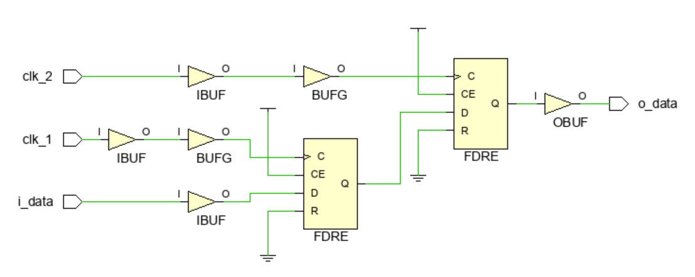

_Рисунок 4. Схема проекта._

Чтобы Vivado смог провести временной анализ, ему необходимо указать периоды и начальные фазы тактовых сигналов. Пусть период запускающего тактового сигнала равен 10 нс, а защелкивающего – 5 нс. Занесем в xdc-файл следующие команды [1]:
```tcl
# период запускающего тактового сигнала
create_clock -period 10.0 -name clk_1 [get_ports clk_1]

# период защелкивающего тактового сигнала
create_clock -period 5.0 -name clk_2 [get_ports clk_2]
```
По умолчанию при создании ограничений на период тактового сигнала считается, что его фронт формируется в нулевой момент времени. Чтобы это изменить, в команду `create_clock` нужно добавить ключ `-waveform` [4].

Проверить корректность проведения временного анализа при пересечении тактовых доменом можно с помощью отчета, который называется _Clock Interaction_. Он представляет из себя таблицу, где по горизонтали отложены передающие тактовые сигналы, а по вертикали – принимающие. С помощью цвета указывается информация о временном анализе. 

Для нашего примера отчет Clock Interaction будет иметь вид, представленный на рисунке 5. В проекте есть всего одни путь из домена `clk_1` в домен `clk_2`. Тактовые сигналы формируются вне FPGA, поэтому Vivado считает их асинхронными. Это означает, что правильно провести временной анализ невозможно. В таблице клетка на пересечении `clk_1` и `clk_2` обозначена красным цветом.

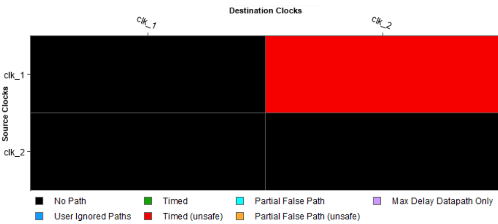

_Рисунок 5. Таблица взаимодействия тактовых сигналов._

Данный отчет также можно получить в текстовой форме, если выполнить в TCL-консоли команду `report_clock_interaction`. Результат представлен ниже:
```
Clock Interaction Table
-----------------------
                            Clock-Pair           Inter-Clock     
From Clock    To Clock      Classification       Constraints     
------------  ------------  -------------------  --------------  
clk_1         clk_2         No Common Clock      Timed (unsafe)
```
Можно увидеть, что для пути между доменами временной анализ проводится (_Timed_), но его результатам не следует доверять (_unsafe_). Причиной является асинхронность тактовых сигналов, так как они формируются из разных источников (_No Common Clock_).

Теперь рассмотрим случай, когда тактовые сигналы синхронные. Для этого добавим в проект PLL. На рисунке 6 показаны настройки PLL, а на рисунке 7 – схема нового проекта. Описание проекта на SystemVerilog представлено ниже:
```verilog
module top_2 (
    input  logic i_clk,
    input  logic i_data,
    output logic o_data
);
    logic clk_1;
    logic clk_2;
    logic cdc_data;

    clk_wiz_0 pll
    (
        .i_clk (i_clk),
        .clk_1 (clk_1),
        .clk_2 (clk_2)
    );
    // передающий тактовый домен
    always_ff @(posedge clk_1)
        cdc_data <= i_data;
    // принимающий тактовый домен
    always_ff @(posedge clk_2)
        o_data <= cdc_data;
endmodule
```

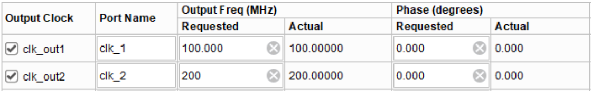

_Рисунок 6. Настройки PLL._

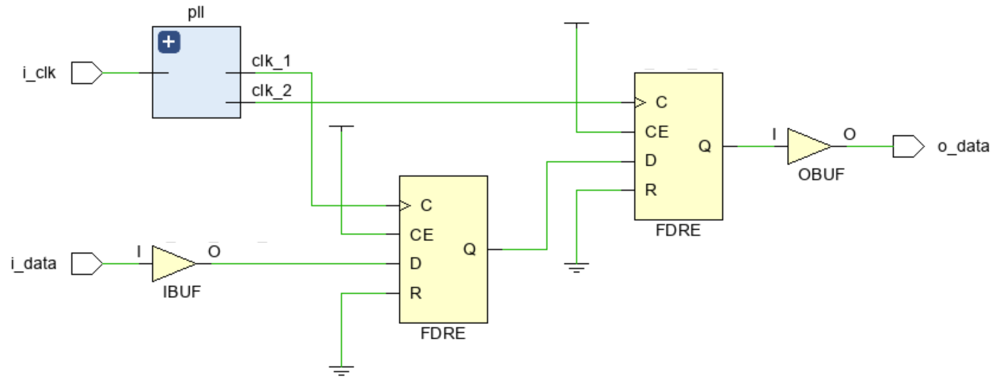

_Рисунок 7. Схема проекта._

На ножку FPGA приходит тактовый сигнал `i_clk`, из которого с помощью PLL формируются два сигнала `clk_1` и `clk_2`. Добавим в xdc-файл следующие команды:
```tcl
# период входного тактового сигнала
create_clock -period 10.0 -name i_clk [get_ports i_clk]

# объявление переменных, которые указывают места формирования тактовых сигналов
set pll_input    [get_pins pll/inst/mmcm_adv_inst/CLKIN1] 
set pll_output_1 [get_pins pll/inst/mmcm_adv_inst/CLKOUT0]
set pll_output_2 [get_pins pll/inst/mmcm_adv_inst/CLKOUT1]

# обновление имен тактовых сигналов, сгенерированных с помощью PLL 
create_generated_clock -name clk_1 -source $pll_input $pll_output_1
create_generated_clock -name clk_2 -source $pll_input $pll_output_2
```

Временному анализатору с помощью команды `create_clock` необходимо указать период сигнала `i_clk`. Зная его, а также учитывая настройки PLL, анализатор самостоятельно определит периоды сигналов `clk_1` и `clk_2`. Некоторое неудобство может доставлять то, что для сигналов `clk_1` и `clk_2` анализатор сгенерирует очень длинные и трудночитаемые имена. Чтобы их изменить, можно с помощью команды `set` объявить переменные, указывающие места формирования тактовых сигналов. Далее, используя команду `create_generated_clock` с ключом `-name`, сигналам нужно присвоить более простые имена. В нашем случае просто `clk_1` и `clk_2`.

На рисунке 8 представлен отчет Clock Interaction. Можно увидеть, что теперь ячейка, соответствующая пути из домена clk_1 в домен clk_2, выделена зеленым цветом. 

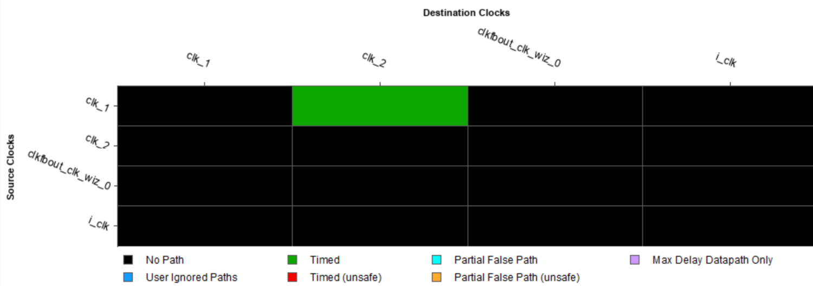

_Рисунок 8. Таблица взаимодействия тактовых сигналов._

Ниже представлен отчет _Clock Interaction_ в текстовом виде:
```
Clock Interaction Table
-----------------------
                            Clock-Pair           Inter-Clock     
From Clock    To Clock      Classification       Constraints     
------------  ------------  -------------------  -----------  
clk_1         clk_2         Clean                Timed      
```
Временной анализ выполняется и теперь считается корректным (_Timed_), так как все временные соотношения между тактовыми сигналами точно известны (_Clean_).

## 3. False Path Constrains.

Иногда наличие в проекте асинхронных тактовых сигналов, для которых выполняется временной анализ, может привести к проблемам. Опять рассмотрим проект, который состоит всего из двух триггеров (см. рисунок 4). В xdc-файл добавим команды, указывающие, что периоды сигналов `clk_1` и `clk_2` равны 10 и 5 нс соответственно:
```tcl
# период запускающего тактового сигнала
create_clock -period 10.0 -name clk_1 [get_ports clk_1]

# период защелкивающего тактового сигнала
create_clock -period 5.0 -name clk_2 [get_ports clk_2]
```
На рисунке 9 показан раздел Summary временного отчета для пути между тактовыми доменами при анализе по Setup. В строке Requirements можно увидеть, что запускающий фронт сигнала `clk_1` формируется в нулевой момент времени. Через 5 нс после это появляется защелкивающий фронт сигнала `clk_2`. Общий период равен 10 нс. В течение этого времени наблюдается всего один фронт `clk_1`. Таким образом анализатор находит, что значение $\Delta T_{su}$ равно 5 нс.

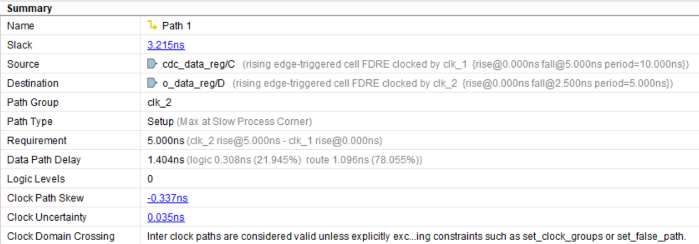

_Рисунок 9. Раздел Summary временного отчета._

Хотя это и не имеет смысла, но анализатор все равно вычисляет все задержки и рассчитывает значение Slack. Величина запаса больше нуля и равна 3.215 нс, то есть временные ограничения как будто выполнены.

Далее, изменим период сигнала `clk_2` и сделаем его равным 33 нс. Файл с ограничениями имеет вид:
```tcl
# период запускающего тактового сигнала
create_clock -period 10.0 -name clk_1 [get_ports clk_1]

# период защелкивающего тактового сигнала
create_clock -period 33.3 -name clk_2 [get_ports clk_2]
```
Раздел _Summary_ временного отчета для нового периода `clk_2` показан на рисунке 10. Теперь $Slack$ имеет отрицательное значение, то есть временные ограничения не выполнены. Давайте найдем причину. 

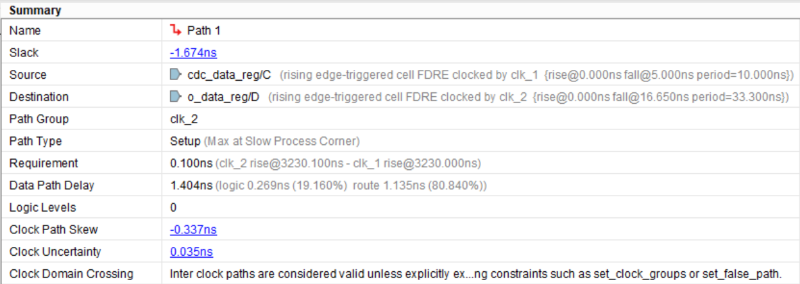

_Рисунок 10. Раздел Summary временного отчета._

В строке Requirements указано минимальное значение $\Delta T_{su}$, равное 0.1 нс. Это соответствует случаю, когда 323-ий запускающий фронт сигнала clk_1 появляется в момент времени 3230 нс, а 97-ой защелкивающий фронт сигнала `clk_2` – в момент времени 3230.1 нс. Данные от одного триггера к другому должны быть переданы всего за 0.1 нс, что является трудновыполнимой задачей. В соответствии с расчетами данные опаздывают на целых -1.674 нс.

Мы знаем, что сигналы асинхронные, поэтому отчет не является корректным, и на это нарушение можно не обращать внимания. Однако, в процессе размещения и трассировки Vivado будет стремиться выполнить все ограничения, причем самые сложные, такие как $\Delta T_{su} = 0.1 нс$, рассматриваются в первую очередь. Из-за этого возможна ситуация, когда Vivado приложит все усилия, чтобы выполнить временные ограничения для одного критического пути за счет наличия небольших нарушений для других путей. То есть, в проекте появятся нарушения, которых могло бы и не быть, если бы путь между асинхронными доменами не участвовал во временном анализе.

Чтобы исключить путь из временного анализа, можно воспользоваться командой `set_false_path`. Флаг `-from` указывает начало пути, а флаг `-to` – его конец. Напомним, что путь всегда начинается на тактовом входе запускающего триггера и заканчивается на одном из входов защелкивающего триггера. Для нашего примера в xdc-файл нужно добавить следующую команду: 
```tcl
# объявление false path через начало и конец пути
set_false_path -from [get_pins cdc_data_reg/C] -to [get_pins o_data_reg/D]
```
С помощью команды get_pins получаем тактовый вход запускающего (`cdc_data_reg/C`) и информационный вход защелкивающего (`o_data_reg/D`) триггеров.

Рассмотрим, как изменился раздел Summary временного отчета (см. рисунок 11). Можно увидеть, что теперь значение Slack и требуемое время передачи данных (_Requirement_) равны бесконечности. Также в отчете появилась дополнительная строка _Timing Exception_, указывающая, что путь был исключен из анализа с помощью команды `false path`.

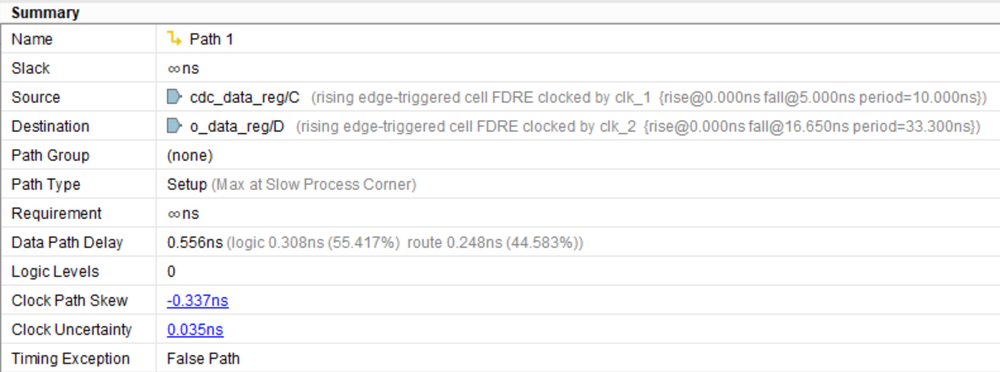

_Рисунок 11. Раздел Summary временного отчета._

Теперь изучим, как это отразилось на отчете Clock Interaction (см. рисунок 12). Ячейка таблицы, соответствующая пути из домена `clk_1` в домен `clk_2`, помечена синим цветом. Это означает, что разработчик проекта вручную исключил пути из временного анализа (_User Ignored Paths_).

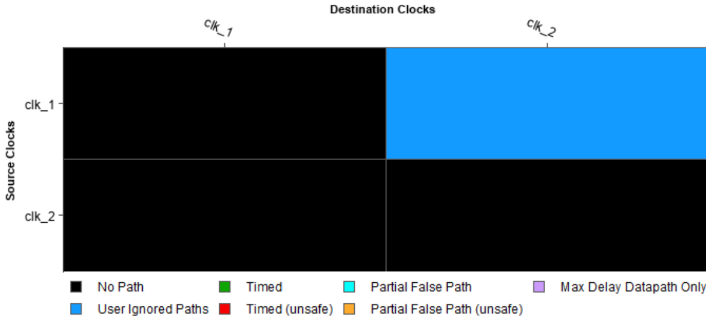

_Рисунок 12. Таблица взаимодействия тактовых сигналов._

Ту же информацию можно получить в текстовой форме: 
```
Clock Interaction Table
-----------------------
                            Clock-Pair           Inter-Clock  
From Clock    To Clock      Classification       Constraints  
------------  ------------  -------------------  -----------  
clk_1         clk_2         Ignored              False Path   
```

Далее, рассмотрим еще несколько способов исключения пути из временного анализа. В качестве начала и конца пути для команды `set_false_path` можно просто задать запускающий и защелкивающий триггеры. 
```tcl
# объявление false path через запускающий и защелкивающий триггеры
set_false_path -from [get_cells cdc_data_reg] -to [get_cells o_data_reg]
```

В этом случае будут исключены пути, идущие от входа C триггера `cdc_data_reg` до всех входов триггера o_data_reg (входы `D`, `CE` и другие). Также можно исключить сразу все пути, идущие из тактового домена `clk_1` в домен `clk_2`. Для этого нужно указать тактовые сигналы с помощью команды `get_clocks`:

```tcl
# объявление false path через имена тактовых доменов
set_false_path -from [get_clocks clk_1] -to [get_clocks clk_2]
```

Еще один способ заключается в объявлении тактовых доменов асинхронными. Для этого нужно с помощью команды `set_clock_groups` определить группы тактовых сигналов и добавить для них флаг `-asynchronous`. В этом случае из анализа будут исключаться все пути из домена `clk_1` в домен `clk_2`, а также из домен `clk_2` в домен `clk_1`. Флаг -name задает имя, по которому можно в дальнейшем обращаться к асинхронным группам. 

```tcl
# объявление тактовых доменов асинхронными
set_clock_groups -name cdc_async -group [get_clocks clk_1] -group [get_clocks clk_2] -asynchronous
```

То, что домены являются асинхронными, также отражается в отчете Clock Interaction: 
```
Clock Interaction Table
-----------------------
                            Clock-Pair           Inter-Clock          
From Clock    To Clock      Classification       Constraints          
------------  ------------  -------------------  -------------------  
clk_1         clk_2         Ignored              Asynchronous Groups
```

## 4. Отчет о CDC.

Применение `false path` и асинхронных групп может защитить от появления ложных нарушений, но не гарантирует, что между тактовыми доменами данные пересылаются корректно. Правильность передачи данных между доменами можно проверить с помощью отчета о **CDC** (_Clock Domain Cross_). Для этого в TCL-консоли Vivado нужно выполнить команду `report_cdc`. Ее результат для примера из рисунка 4 представлен ниже:
```
CDC Report

Severity  Source Clock  Destination Clock  Exceptions           Endpoints  Safe  Unsafe  Unknown  No ASYNC_REG
--------  ------------  -----------------  -------------------  ---------  ----  ------  -------  ------------
Critical  clk_1         clk_2              Asynch Clock Groups          1     0       0        1             0
```

Из отчета следует, что установить корректность передачи данных из домена `clk_1` в домен `clk_2` невозможно (`Unknown = 1`). Это приводит к наличию в проекте критического замечания (`Severity = Critical`). Более подробно о причине замечания можно узнать в отчете **Report Methodology** (см. вкладку Vivado Flow Navigator). Один из его разделов представлен ниже:

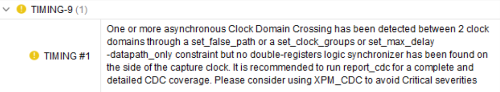

_Рисунок 13. Отчет о проверке методологии проектирования._

В нашем проекте есть путь, который пересекает тактовые домены и исключен из временного анализа с помощью команды `set_false_path` или `set_clock_groups`. Чтобы гарантировать правильность передачи между асинхронными доменами, данные должны проходить через специальные синхронизаторы, например, через сдвоенные триггеры (_double-register logic_). При формировании отчета о CDC Vivado просматривает netlist и пытается найти между доменами синхронизаторы. В случае их отсутствия выводится соответствующее замечание. Все структуры в netlist, которые Vivado распознает как синхронизаторы, можно посмотреть в [2] в главе 2.  

Чтобы получить синхронизатор на основе сдвоенных триггеров, добавим в домен `clk_2` еще одни триггер `sync_data_reg`. Схема обновленного проекта (см. рисунок 14) и его описание на SystemVerilog представлены ниже:

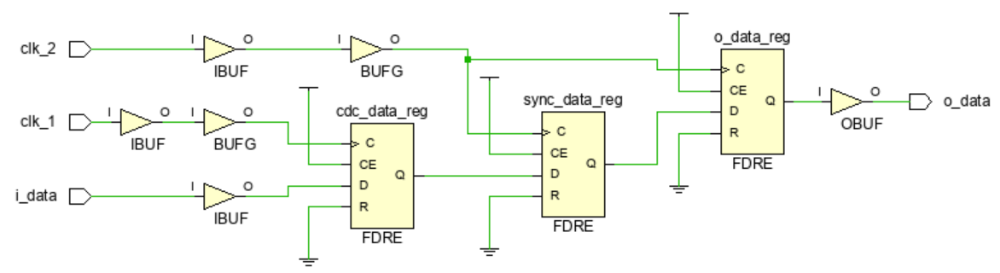

_Рисунок 14. Схема проекта._
```verilog
module top_3 (
    input  logic clk_1,
    input  logic clk_2,
    input  logic i_data,
    output logic o_data
);
    logic cdc_data, sync_data;
    // передающий тактовый домен
    always_ff @(posedge clk_1)
        cdc_data <= i_data;
    // принимающий тактовый домен
    always_ff @(posedge clk_2) begin
        sync_data <= cdc_data;
        o_data <= sync_data;
    end    
endmodule
```

Кратко разберем принцип работы синхронизатора. Так как домены `clk_1` и `clk_2` являются асинхронными, временные соотношения между их тактовыми сигналами неизвестны. Это означает, что при передаче данных для триггера `sync_data_reg` могут возникать нарушения времени установки и удержания, и он будет попадать в метастабильное состояние. В случае метастабильности сигнал на выходе `sync_data_reg` примет некоторый неопределенный уровень между нулем и единицей. Этот сигнал будет распространяться дальше по схеме и в итоге попадет на вход триггера `o_data_reg`. 

Если теперь на триггер `o_data_reg` подать тактовый фронт, то он защелкнет неопределенный уровень и сам перейдет в метастабильное состояние. Однако, как было сказано ранее, метастабильность – это состояние неустойчивое. Рано или поздно триггер `sync_data_reg` из него выйдет, и на его выходе опять появится нормальный логический уровень. Если это произойдет до появления следующего тактового фронта, то триггер `o_data_reg` не увидит сигнал неопределенного уровня и не перейдет в метастабильное состояние.   

Таким образом, триггер `sync_data_reg` может попасть в метастабильное состояние, но, если он быстро из него выйдет, то метастабильность не появится на выходе `o_data_reg` и будет локализована внутри синхронизатора.

Рассмотрим, как изменился отчет о CDC после добавления синхронизатора. Теперь данные между доменами передаются корректно (`Safe = 1`), однако, к проекту по-прежнему есть замечания (`Severity = Warning`).
```
CDC Report

Severity  Source Clock  Destination Clock  Exceptions           Endpoints  Safe  Unsafe  Unknown  No ASYNC_REG
--------  ------------  -----------------  -------------------  ---------  ----  ------  -------  ------------
Warning   clk_1         clk_2              Asynch Clock Groups          1     1       0        0             1
```

## 5. Свойство ASYNC_REG.

Чтобы понять причину оставшегося замечания, опять рассмотрим отчет Report Methodology. Его результаты представлены ниже:

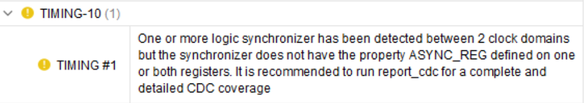

_Рисунок 15. Отчет о проверке методологии проектирования._

Между тактовыми доменами данные передаются с помощью синхронизатора, но триггеры, входящие в его состав, не имеют свойства `ASYNC_REG`. Эту же информацию можно получить из последнего отчета о CDC (`No ASYNC_REG = 1`). Чтобы понять назначение этого свойства, вернемся к схеме проекта на рисунке 14. 

Как было рассказано ранее, триггер `sync_data_reg` может становиться метастабильным. При этом, если он вернется в нормальное состояние до появления следующего тактового фронта, то триггер `o_data_reg` эту метастабильность не увидит. Однако, триггер `sync_data_reg` не просто должен успеть выйти из метастабильности, но и его выходной сигнал с нормальным логическим уровнем должен успеть распространиться до входа `o_data_reg`. Время выхода из метастабильного состояния – это величина случайная. Поэтому вероятность того, что на следующем фронте триггер `o_data_reg` увидит нормальный уровень сигнала, будет выше, если время передачи данных между триггерами будет как можно меньше.

Свойство `ASYNC_REG` указывает Vivado, что триггер входит в состав синхронизатора. Чтобы уменьшить вероятность появления метастабильности на выходе синхронизатора, в процессе размещения и трассировки Vivado будет стараться сократить длину пути между триггерами со свойством `ASYNC_REG` и располагать их как можно ближе друг к другу. Также свойство `ASYNC_REG` запрещает проводить для таких триггеров некоторые виды оптимизации, например, `retiming` [5].

Добавим триггерам `sync_data_reg` и `o_data_reg` из предыдущего примера свойство `ASYNC_REG`. Полное содержимое xdc-файла представлено ниже:
```tcl
# период запускающего тактового сигнала
create_clock -period 10.0 -name clk_1 [get_ports clk_1]

# период защелкивающего тактового сигнала
create_clock -period 33.3 -name clk_2 [get_ports clk_2]

# объявление тактовых доменов асинхронными
set_clock_groups -name cdc_async -group [get_clocks clk_1] -group [get_clocks clk_2] -asynchronous

# объявление синхронизирующих триггеров
set_property ASYNC_REG true [get_cells {sync_data_reg o_data_reg}]
```

Теперь триггеры, которые входят в состав синхронизатора, помечены свойством `ASYNC_REG`, что указано в отчете о CDC как `No ASYNC_REG = 0`. К проекту больше нет замечаний (`Severity = Info`).
```
CDC Report

Severity  Source Clock  Destination Clock  Exceptions           Endpoints  Safe  Unsafe  Unknown  No ASYNC_REG
--------  ------------  -----------------  -------------------  ---------  ----  ------  -------  ------------
Info      clk_1         clk_2              Asynch Clock Groups          1     1       0        0             0
```

В заключении отметим, что в _Vivado Language Templates_ в разделе CDC есть готовые параметризируемые синхронизаторы. Модуль, описывающий синхронизатор из цепочки последовательно соединенных триггеров, называется `xpm_cdc_single`. Давайте попробуем его использовать. Ниже представлена схема проекта (см. рисунок 16) и его описание:
```verilog
module top_4 (
    input  logic clk_1,
    input  logic clk_2,
    input  logic i_data,
    output logic o_data
);
    logic cdc_data, sync_data;
    // передающий тактовый домен
    always_ff @(posedge clk_1)
        cdc_data <= i_data;
    // XPM синхронизатор
    xpm_cdc_single #(
        .DEST_SYNC_FF(2),   
        .SRC_INPUT_REG(0)
    )
    xpm_synchronizer (
        .src_clk(clk_1),
        .src_in(cdc_data),
        .dest_clk(clk_2),
        .dest_out(sync_data)
    );
    // принимающий тактовый домен
    always_ff @(posedge clk_2)
        o_data <= sync_data;
endmodule
```

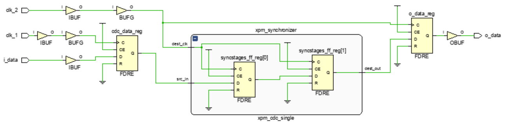

_Рисунок 16. Схема проекта._

У синхронизатора есть несколько настроек. Так параметр `SRC_INPUT_REG` указывает требуется (`1`) или нет (`0`) поместить дополнительный триггер в передающий тактовый домен. С помощью параметра `DEST_SYNC_FF` можно задать количество триггеров в принимающем домене. Минимально возможное значение этого параметра равно двум.

В xdc-файл добавим только ограничения на периоды тактовых сигналов:
```tcl
# период запускающего тактового сигнала
create_clock -period 10.0 -name clk_1 [get_ports clk_1]

# период защелкивающего тактового сигнала
create_clock -period 33.3 -name clk_2 [get_ports clk_2]
```

Из отчета о CDC можно увидеть, что при использовании готового синхронизатора путь между тактовыми доменами исключается из временного анализа (`Exceptions = False Path`), а триггерам синхронизатора автоматически присваивается свойство `ASYNC_REG`.  
```
CDC Report

Severity  Source Clock  Destination Clock  Exceptions           Endpoints  Safe  Unsafe  Unknown  No ASYNC_REG
--------  ------------  -----------------  -------------------  ---------  ----  ------  -------  ------------
Info      clk_1         clk_2              False Path                   1     1       0        0             0
```

Использование синхронизаторов из Vivado Language Templates упрощает процесс создания проекта и существенно снижает количество ошибок при описании временных ограничений.

## Заключение.

В статье представлен временной анализ при передаче данных между тактовыми доменами. Рассказано о возможных проблемах, возникающих из-за нарушения временных ограничений для асинхронных тактовых сигналов. Рассмотрены несколько способов исключения пути из временного анализа. Кратко описан принцип работы синхронизатора на основе сдвоенных триггеров.

## Ссылки

1. [Основы статического временного анализа. Часть 1: Period Constraint](./timings1_intro.md)
2. [Vivado Design Analysis and Closure Techniques (UG 906)](https://docs.xilinx.com/v/u/2017.3-English/ug906-vivado-design-analysis)
3. [Xilinx Support Forum](https://support.xilinx.com/s/question/0D52E00006mibS0SAI/constraining-2-external-clocks-that-are-synchronous?language=en_US)
4. [Vivado Using Constraints (UG 903)](https://docs.xilinx.com/v/u/2013.1-English/ug903-vivado-using-constraints)
5. [Vivado Synthesis (UG 901)](https://docs.xilinx.com/v/u/2021.1-English/ug901-vivado-synthesis)